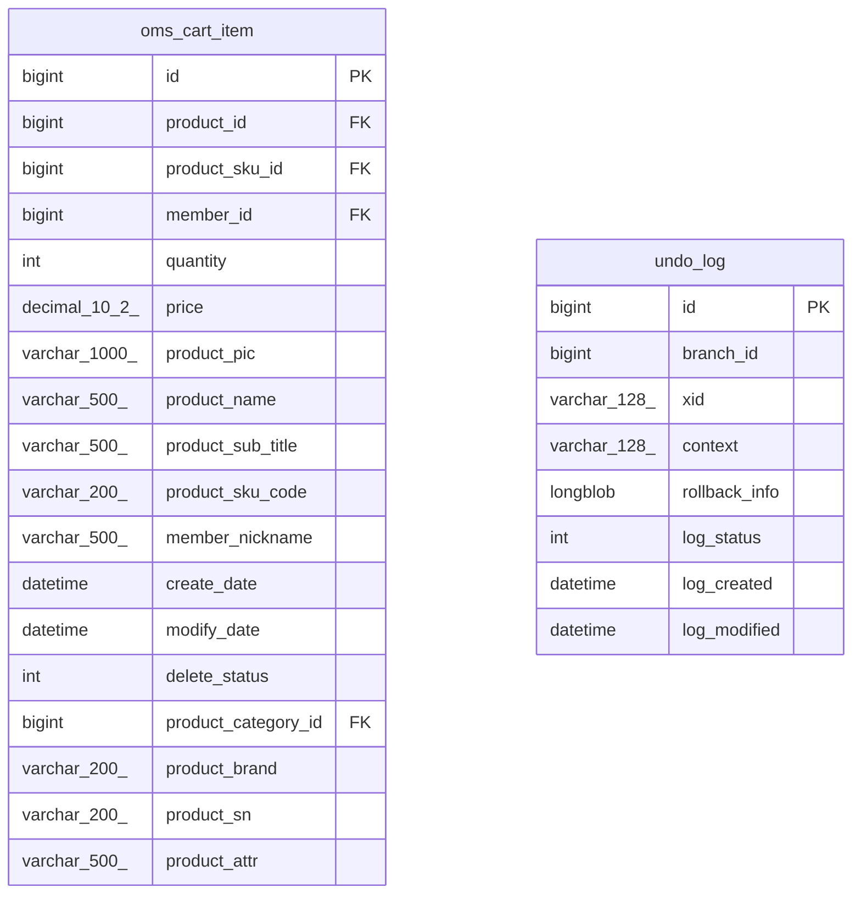
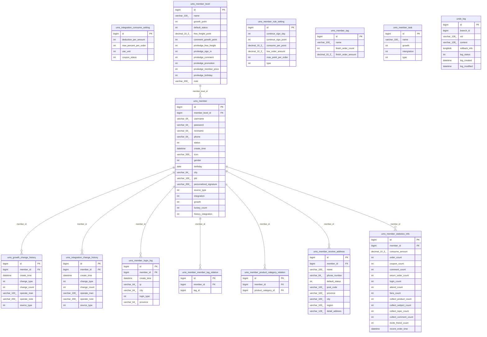
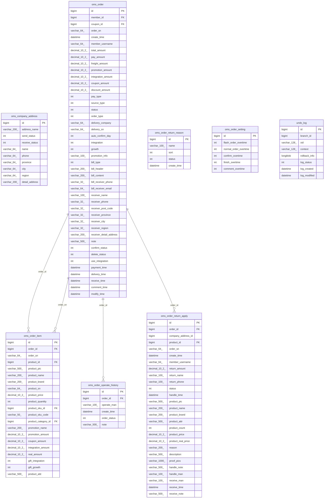
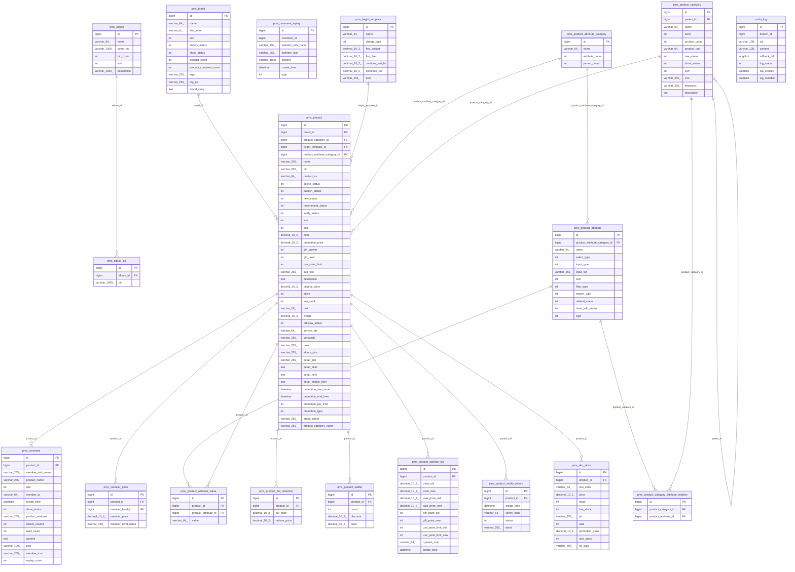

# Mall-Cloud 数据库表结构说明与 ER 图

> 生成来源：`document/sql/*.sql`。SQL 中未定义物理 `FOREIGN KEY`，本文中的外键和关系均根据字段名、表名、注释及电商业务语义推断。
> 订单、购物车、营销表中存在较多快照字段，字段值会冗余商品、会员、优惠券等信息，用于保持历史数据稳定。

## 1. 数据库总览

| 数据库 | SQL 文件 | 表数量 | 模块说明 |
|---|---:|---:|---|
| `mall_cart` | `mall_cart.sql` | 2 | 购物车库 |
| `mall_marketing` | `mall_marketing.sql` | 27 | 营销与内容库 |
| `mall_member` | `mall_member.sql` | 14 | 会员中心库 |
| `mall_order` | `mall_order.sql` | 8 | 订单中心库 |
| `mall_product` | `mall_product.sql` | 19 | 商品中心库 |
| `mall_user` | `mall_user.sql` | 17 | 后台用户与权限库 |
| `seata` | `seata.sql` | 4 | Seata 事务协调库 |

### 重要说明

- 所有业务库均包含或可能包含 `undo_log`，这是 Seata AT 模式的本地回滚日志表，不属于业务实体。
- `mall_user.sql` 中也包含 `ums_member_level`、积分/成长值配置等会员相关表；`mall_member.sql` 中包含完整会员主数据。实际微服务拆库时应以服务边界和配置为准。
- 本文中的“业务FK”不是数据库物理外键，只表示代码或业务上大概率按该字段关联。

## 2. 核心业务关系总览

| 来源表 | 字段 | 目标表 | 基数 | 说明 |
|---|---|---|---|---|
| `mall_cart.oms_cart_item` | `member_id` | `mall_member.ums_member` | N:1 | 字段名业务推断 |
| `mall_cart.oms_cart_item` | `product_category_id` | `mall_product.pms_product_category` | N:1 | 字段名业务推断 |
| `mall_cart.oms_cart_item` | `product_id` | `mall_product.pms_product` | N:1 | 字段名业务推断 |
| `mall_cart.oms_cart_item` | `product_sku_id` | `mall_product.pms_sku_stock` | N:1 | 字段名业务推断 |
| `mall_marketing.cms_prefrence_area_product_relation` | `prefrence_area_id` | `mall_marketing.cms_prefrence_area` | N:1 | 字段名业务推断 |
| `mall_marketing.cms_prefrence_area_product_relation` | `product_id` | `mall_product.pms_product` | N:1 | 字段名业务推断 |
| `mall_marketing.cms_subject_comment` | `subject_id` | `mall_marketing.cms_subject` | N:1 | 字段名业务推断 |
| `mall_marketing.cms_subject_product_relation` | `product_id` | `mall_product.pms_product` | N:1 | 字段名业务推断 |
| `mall_marketing.cms_subject_product_relation` | `subject_id` | `mall_marketing.cms_subject` | N:1 | 字段名业务推断 |
| `mall_marketing.cms_topic_comment` | `topic_id` | `mall_marketing.cms_topic` | N:1 | 字段名业务推断 |
| `mall_marketing.sms_coupon_history` | `coupon_id` | `mall_marketing.sms_coupon` | N:1 | 字段名业务推断 |
| `mall_marketing.sms_coupon_history` | `member_id` | `mall_member.ums_member` | N:1 | 字段名业务推断 |
| `mall_marketing.sms_coupon_history` | `order_id` | `mall_order.oms_order` | N:1 | 字段名业务推断 |
| `mall_marketing.sms_coupon_product_category_relation` | `coupon_id` | `mall_marketing.sms_coupon` | N:1 | 字段名业务推断 |
| `mall_marketing.sms_coupon_product_category_relation` | `product_category_id` | `mall_product.pms_product_category` | N:1 | 字段名业务推断 |
| `mall_marketing.sms_coupon_product_relation` | `coupon_id` | `mall_marketing.sms_coupon` | N:1 | 字段名业务推断 |
| `mall_marketing.sms_coupon_product_relation` | `product_id` | `mall_product.pms_product` | N:1 | 字段名业务推断 |
| `mall_marketing.sms_flash_promotion_log` | `member_id` | `mall_member.ums_member` | N:1 | 字段名业务推断 |
| `mall_marketing.sms_flash_promotion_log` | `product_id` | `mall_product.pms_product` | N:1 | 字段名业务推断 |
| `mall_marketing.sms_flash_promotion_product_relation` | `flash_promotion_id` | `mall_marketing.sms_flash_promotion` | N:1 | 字段名业务推断 |
| `mall_marketing.sms_flash_promotion_product_relation` | `flash_promotion_session_id` | `mall_marketing.sms_flash_promotion_session` | N:1 | 字段名业务推断 |
| `mall_marketing.sms_flash_promotion_product_relation` | `product_id` | `mall_product.pms_product` | N:1 | 字段名业务推断 |
| `mall_marketing.sms_home_brand` | `brand_id` | `mall_product.pms_brand` | N:1 | 字段名业务推断 |
| `mall_marketing.sms_home_new_product` | `product_id` | `mall_product.pms_product` | N:1 | 字段名业务推断 |
| `mall_marketing.sms_home_recommend_product` | `product_id` | `mall_product.pms_product` | N:1 | 字段名业务推断 |
| `mall_marketing.sms_home_recommend_subject` | `subject_id` | `mall_marketing.cms_subject` | N:1 | 字段名业务推断 |
| `mall_marketing.sms_seckill_order` | `member_id` | `mall_member.ums_member` | N:1 | 字段名业务推断 |
| `mall_marketing.sms_seckill_order` | `order_id` | `mall_order.oms_order` | N:1 | 字段名业务推断 |
| `mall_marketing.sms_seckill_order` | `product_id` | `mall_product.pms_product` | N:1 | 字段名业务推断 |
| `mall_member.ums_growth_change_history` | `member_id` | `mall_member.ums_member` | N:1 | 字段名业务推断 |
| `mall_member.ums_integration_change_history` | `member_id` | `mall_member.ums_member` | N:1 | 字段名业务推断 |
| `mall_member.ums_member_login_log` | `member_id` | `mall_member.ums_member` | N:1 | 字段名业务推断 |
| `mall_member.ums_member_member_tag_relation` | `member_id` | `mall_member.ums_member` | N:1 | 字段名业务推断 |
| `mall_member.ums_member_product_category_relation` | `member_id` | `mall_member.ums_member` | N:1 | 字段名业务推断 |
| `mall_member.ums_member_product_category_relation` | `product_category_id` | `mall_product.pms_product_category` | N:1 | 字段名业务推断 |
| `mall_member.ums_member_receive_address` | `member_id` | `mall_member.ums_member` | N:1 | 字段名业务推断 |
| `mall_member.ums_member_statistics_info` | `member_id` | `mall_member.ums_member` | N:1 | 字段名业务推断 |
| `mall_member.ums_member` | `member_level_id` | `mall_member.ums_member_level` | N:1 | 字段名业务推断 |
| `mall_order.oms_order_item` | `order_id` | `mall_order.oms_order` | N:1 | 字段名业务推断 |
| `mall_order.oms_order_item` | `order_sn` | `mall_order.oms_order` | N:1 | 订单明细同时冗余订单编号 |
| `mall_order.oms_order_item` | `product_category_id` | `mall_product.pms_product_category` | N:1 | 字段名业务推断 |
| `mall_order.oms_order_item` | `product_id` | `mall_product.pms_product` | N:1 | 字段名业务推断 |
| `mall_order.oms_order_item` | `product_sku_id` | `mall_product.pms_sku_stock` | N:1 | 字段名业务推断 |
| `mall_order.oms_order_operate_history` | `order_id` | `mall_order.oms_order` | N:1 | 字段名业务推断 |
| `mall_order.oms_order_return_apply` | `order_id` | `mall_order.oms_order` | N:1 | 字段名业务推断 |
| `mall_order.oms_order_return_apply` | `product_id` | `mall_product.pms_product` | N:1 | 字段名业务推断 |
| `mall_order.oms_order` | `coupon_id` | `mall_marketing.sms_coupon` | N:1 | 字段名业务推断 |
| `mall_order.oms_order` | `member_id` | `mall_member.ums_member` | N:1 | 字段名业务推断 |
| `mall_product.pms_album_pic` | `album_id` | `mall_product.pms_album` | N:1 | 字段名业务推断 |
| `mall_product.pms_comment` | `product_id` | `mall_product.pms_product` | N:1 | 字段名业务推断 |
| `mall_product.pms_member_price` | `member_level_id` | `mall_member.ums_member_level` | N:1 | 字段名业务推断 |
| `mall_product.pms_member_price` | `product_id` | `mall_product.pms_product` | N:1 | 字段名业务推断 |
| `mall_product.pms_product_attribute_value` | `product_attribute_id` | `mall_product.pms_product_attribute` | N:1 | 字段名业务推断 |
| `mall_product.pms_product_attribute_value` | `product_id` | `mall_product.pms_product` | N:1 | 字段名业务推断 |
| `mall_product.pms_product_attribute` | `product_attribute_category_id` | `mall_product.pms_product_attribute_category` | N:1 | 字段名业务推断 |
| `mall_product.pms_product_category_attribute_relation` | `product_attribute_id` | `mall_product.pms_product_attribute` | N:1 | 字段名业务推断 |
| `mall_product.pms_product_category_attribute_relation` | `product_category_id` | `mall_product.pms_product_category` | N:1 | 字段名业务推断 |
| `mall_product.pms_product_category` | `parent_id` | `mall_product.pms_product_category` | N:1 | 树形层级父子关系 |
| `mall_product.pms_product_full_reduction` | `product_id` | `mall_product.pms_product` | N:1 | 字段名业务推断 |
| `mall_product.pms_product_ladder` | `product_id` | `mall_product.pms_product` | N:1 | 字段名业务推断 |
| `mall_product.pms_product_operate_log` | `product_id` | `mall_product.pms_product` | N:1 | 字段名业务推断 |
| `mall_product.pms_product_vertify_record` | `product_id` | `mall_product.pms_product` | N:1 | 字段名业务推断 |
| `mall_product.pms_product` | `brand_id` | `mall_product.pms_brand` | N:1 | 字段名业务推断 |
| `mall_product.pms_product` | `feight_template_id` | `mall_product.pms_feight_template` | N:1 | 字段名业务推断 |
| `mall_product.pms_product` | `product_attribute_category_id` | `mall_product.pms_product_attribute_category` | N:1 | 字段名业务推断 |
| `mall_product.pms_product` | `product_category_id` | `mall_product.pms_product_category` | N:1 | 字段名业务推断 |
| `mall_product.pms_sku_stock` | `product_id` | `mall_product.pms_product` | N:1 | 字段名业务推断 |
| `mall_user.ums_admin_login_log` | `admin_id` | `mall_user.ums_admin` | N:1 | 字段名业务推断 |
| `mall_user.ums_admin_permission_relation` | `admin_id` | `mall_user.ums_admin` | N:1 | 字段名业务推断 |
| `mall_user.ums_admin_permission_relation` | `permission_id` | `mall_user.ums_permission` | N:1 | 字段名业务推断 |
| `mall_user.ums_admin_role_relation` | `admin_id` | `mall_user.ums_admin` | N:1 | 字段名业务推断 |
| `mall_user.ums_admin_role_relation` | `role_id` | `mall_user.ums_role` | N:1 | 字段名业务推断 |
| `mall_user.ums_growth_change_history` | `member_id` | `mall_member.ums_member` | N:1 | 字段名业务推断 |
| `mall_user.ums_integration_change_history` | `member_id` | `mall_member.ums_member` | N:1 | 字段名业务推断 |
| `mall_user.ums_menu` | `parent_id` | `mall_user.ums_menu` | N:1 | 树形层级父子关系 |
| `mall_user.ums_permission` | `pid` | `mall_user.ums_permission` | N:1 | 树形层级父子关系 |
| `mall_user.ums_role_menu_relation` | `menu_id` | `mall_user.ums_menu` | N:1 | 字段名业务推断 |
| `mall_user.ums_role_menu_relation` | `role_id` | `mall_user.ums_role` | N:1 | 字段名业务推断 |
| `mall_user.ums_role_permission_relation` | `permission_id` | `mall_user.ums_permission` | N:1 | 字段名业务推断 |
| `mall_user.ums_role_permission_relation` | `role_id` | `mall_user.ums_role` | N:1 | 字段名业务推断 |
| `mall_user.ums_role_resource_relation` | `resource_id` | `mall_user.ums_resource` | N:1 | 字段名业务推断 |
| `mall_user.ums_role_resource_relation` | `role_id` | `mall_user.ums_role` | N:1 | 字段名业务推断 |

## 3. 全局核心 ER 图

```mermaid
erDiagram
  ums_member {
    bigint id PK
    bigint member_level_id FK
    varchar_64_ username
    varchar_64_ password
    varchar_64_ nickname
    varchar_64_ phone
    int status
    datetime create_time
    varchar_500_ icon
    int gender
  }
  ums_member_level {
    bigint id PK
    varchar_100_ name
    int growth_point
    int default_status
    decimal_10_2_ free_freight_point
    int comment_growth_point
    int priviledge_free_freight
    int priviledge_sign_in
    int priviledge_comment
    int priviledge_promotion
  }
  pms_product {
    bigint id PK
    bigint brand_id FK
    bigint product_category_id FK
    bigint feight_template_id FK
    bigint product_attribute_category_id FK
    varchar_200_ name
    varchar_255_ pic
    varchar_64_ product_sn
    int delete_status
    int publish_status
  }
  pms_sku_stock {
    bigint id PK
    bigint product_id FK
    varchar_64_ sku_code
    decimal_10_2_ price
    int stock
    int low_stock
    varchar_255_ pic
    int sale
    decimal_10_2_ promotion_price
    int lock_stock
  }
  pms_brand {
    bigint id PK
    varchar_64_ name
    varchar_8_ first_letter
    int sort
    int factory_status
    int show_status
    int product_count
    int product_comment_count
    varchar_255_ logo
    varchar_255_ big_pic
  }
  pms_product_category {
    bigint id PK
    bigint parent_id
    varchar_64_ name
    int level
    int product_count
    varchar_64_ product_unit
    int nav_status
    int show_status
    int sort
    varchar_255_ icon
  }
  oms_order {
    bigint id PK
    bigint member_id FK
    bigint coupon_id FK
    varchar_64_ order_sn
    datetime create_time
    varchar_64_ member_username
    decimal_10_2_ total_amount
    decimal_10_2_ pay_amount
    decimal_10_2_ freight_amount
    decimal_10_2_ promotion_amount
  }
  oms_order_item {
    bigint id PK
    bigint order_id FK
    varchar_64_ order_sn
    bigint product_id FK
    varchar_500_ product_pic
    varchar_200_ product_name
    varchar_200_ product_brand
    varchar_64_ product_sn
    decimal_10_2_ product_price
    int product_quantity
  }
  oms_cart_item {
    bigint id PK
    bigint product_id FK
    bigint product_sku_id FK
    bigint member_id FK
    int quantity
    decimal_10_2_ price
    varchar_1000_ product_pic
    varchar_500_ product_name
    varchar_500_ product_sub_title
    varchar_200_ product_sku_code
  }
  sms_coupon {
    bigint id PK
    int type
    varchar_100_ name
    int platform
    int count
    decimal_10_2_ amount
    int per_limit
    decimal_10_2_ min_point
    datetime start_time
    datetime end_time
  }
  sms_coupon_history {
    bigint id PK
    bigint coupon_id FK
    bigint member_id FK
    varchar_64_ coupon_code
    varchar_64_ member_nickname
    int get_type
    datetime create_time
    int use_status
    datetime use_time
    bigint order_id FK
  }
  sms_flash_promotion {
    bigint id PK
    varchar_200_ title
    date start_date
    date end_date
    int status
    datetime create_time
  }
  sms_flash_promotion_session {
    bigint id PK
    varchar_200_ name
    time start_time
    time end_time
    int status
    datetime create_time
  }
  sms_flash_promotion_product_relation {
    bigint id PK
    bigint flash_promotion_id FK
    bigint flash_promotion_session_id FK
    bigint product_id FK
    decimal_10_2_ flash_promotion_price
    int flash_promotion_count
    int flash_promotion_limit
    int sort
  }
  ums_admin {
    bigint id PK
    varchar_64_ username
    varchar_64_ password
    varchar_500_ icon
    varchar_100_ email
    varchar_200_ nick_name
    varchar_500_ note
    datetime create_time
    datetime login_time
    int status
  }
  ums_role {
    bigint id PK
    varchar_100_ name
    varchar_500_ description
    int admin_count
    datetime create_time
    int status
    int sort
  }
  ums_menu {
    bigint id PK
    bigint parent_id
    datetime create_time
    varchar_100_ title
    int level
    int sort
    varchar_100_ name
    varchar_200_ icon
    int hidden
  }
  ums_resource {
    bigint id PK
    datetime create_time
    varchar_200_ name
    varchar_200_ url
    varchar_500_ description
    bigint category_id
  }
  ums_member ||--o{ oms_cart_item : member_id
  pms_product_category ||--o{ oms_cart_item : product_category_id
  pms_product ||--o{ oms_cart_item : product_id
  pms_sku_stock ||--o{ oms_cart_item : product_sku_id
  sms_coupon ||--o{ sms_coupon_history : coupon_id
  ums_member ||--o{ sms_coupon_history : member_id
  oms_order ||--o{ sms_coupon_history : order_id
  sms_flash_promotion ||--o{ sms_flash_promotion_product_relation : flash_promotion_id
  sms_flash_promotion_session ||--o{ sms_flash_promotion_product_relation : flash_promotion_session_id
  pms_product ||--o{ sms_flash_promotion_product_relation : product_id
  ums_member_level ||--o{ ums_member : member_level_id
  oms_order ||--o{ oms_order_item : order_id
  oms_order ||--o{ oms_order_item : order_sn
  pms_product_category ||--o{ oms_order_item : product_category_id
  pms_product ||--o{ oms_order_item : product_id
  pms_sku_stock ||--o{ oms_order_item : product_sku_id
  sms_coupon ||--o{ oms_order : coupon_id
  ums_member ||--o{ oms_order : member_id
  pms_product_category ||--o{ pms_product_category : parent_id
  pms_brand ||--o{ pms_product : brand_id
  pms_product_category ||--o{ pms_product : product_category_id
  pms_product ||--o{ pms_sku_stock : product_id
  ums_menu ||--o{ ums_menu : parent_id
```



## 4. 分库 ER 图

### mall_cart - 购物车库



### mall_marketing - 营销与内容库

```mermaid
erDiagram
  cms_help {
    bigint id PK
    bigint category_id
    varchar_500_ icon
    varchar_100_ title
    int show_status
    datetime create_time
    int read_count
    text content
  }
  cms_help_category {
    bigint id PK
    varchar_100_ name
    varchar_500_ icon
    int help_count
    int show_status
    int sort
  }
  cms_member_report {
    bigint id
    int report_type
    varchar_100_ report_member_name
    datetime create_time
    varchar_100_ report_object
    int report_status
    int handle_status
    varchar_200_ note
  }
  cms_prefrence_area {
    bigint id PK
    varchar_255_ name
    varchar_255_ sub_title
    varbinary_500_ pic
    int sort
    int show_status
  }
  cms_prefrence_area_product_relation {
    bigint id PK
    bigint prefrence_area_id FK
    bigint product_id FK
  }
  cms_subject {
    bigint id PK
    bigint category_id
    varchar_100_ title
    varchar_500_ pic
    int product_count
    int recommend_status
    datetime create_time
    int collect_count
    int read_count
    int comment_count
    varchar_1000_ album_pics
    varchar_1000_ description
    int show_status
    text content
    int forward_count
    varchar_200_ category_name
  }
  cms_subject_category {
    bigint id PK
    varchar_100_ name
    varchar_500_ icon
    int subject_count
    int show_status
    int sort
  }
  cms_subject_comment {
    bigint id PK
    bigint subject_id FK
    varchar_255_ member_nick_name
    varchar_255_ member_icon
    varchar_1000_ content
    datetime create_time
    int show_status
  }
  cms_subject_product_relation {
    bigint id PK
    bigint subject_id FK
    bigint product_id FK
  }
  cms_topic {
    bigint id PK
    bigint category_id
    varchar_255_ name
    datetime create_time
    datetime start_time
    datetime end_time
    int attend_count
    int attention_count
    int read_count
    varchar_100_ award_name
    varchar_100_ attend_type
    text content
  }
  cms_topic_category {
    bigint id PK
    varchar_100_ name
    varchar_500_ icon
    int subject_count
    int show_status
    int sort
  }
  cms_topic_comment {
    bigint id PK
    varchar_255_ member_nick_name
    bigint topic_id FK
    varchar_255_ member_icon
    varchar_1000_ content
    datetime create_time
    int show_status
  }
  sms_coupon {
    bigint id PK
    int type
    varchar_100_ name
    int platform
    int count
    decimal_10_2_ amount
    int per_limit
    decimal_10_2_ min_point
    datetime start_time
    datetime end_time
    int use_type
    varchar_200_ note
    int publish_count
    int use_count
    int receive_count
    datetime enable_time
    varchar_64_ code
    int member_level
  }
  sms_coupon_history {
    bigint id PK
    bigint coupon_id FK
    bigint member_id FK
    varchar_64_ coupon_code
    varchar_64_ member_nickname
    int get_type
    datetime create_time
    int use_status
    datetime use_time
    bigint order_id FK
    varchar_100_ order_sn
  }
  sms_coupon_product_category_relation {
    bigint id PK
    bigint coupon_id FK
    bigint product_category_id FK
    varchar_200_ product_category_name
    varchar_200_ parent_category_name
  }
  sms_coupon_product_relation {
    bigint id PK
    bigint coupon_id FK
    bigint product_id FK
    varchar_500_ product_name
    varchar_200_ product_sn
  }
  sms_flash_promotion {
    bigint id PK
    varchar_200_ title
    date start_date
    date end_date
    int status
    datetime create_time
  }
  sms_flash_promotion_log {
    int id PK
    int member_id FK
    bigint product_id FK
    varchar_64_ member_phone
    varchar_100_ product_name
    datetime subscribe_time
    datetime send_time
  }
  sms_flash_promotion_product_relation {
    bigint id PK
    bigint flash_promotion_id FK
    bigint flash_promotion_session_id FK
    bigint product_id FK
    decimal_10_2_ flash_promotion_price
    int flash_promotion_count
    int flash_promotion_limit
    int sort
  }
  sms_flash_promotion_session {
    bigint id PK
    varchar_200_ name
    time start_time
    time end_time
    int status
    datetime create_time
  }
  sms_home_advertise {
    bigint id PK
    varchar_100_ name
    int type
    varchar_500_ pic
    datetime start_time
    datetime end_time
    int status
    int click_count
    int order_count
    varchar_500_ url
    varchar_500_ note
    int sort
  }
  sms_home_brand {
    bigint id PK
    bigint brand_id FK
    varchar_64_ brand_name
    int recommend_status
    int sort
  }
  sms_home_new_product {
    bigint id PK
    bigint product_id FK
    varchar_500_ product_name
    int recommend_status
    int sort
  }
  sms_home_recommend_product {
    bigint id PK
    bigint product_id FK
    varchar_500_ product_name
    int recommend_status
    int sort
  }
  sms_home_recommend_subject {
    bigint id PK
    bigint subject_id FK
    varchar_64_ subject_name
    int recommend_status
    int sort
  }
  sms_seckill_order {
    bigint id PK
    bigint promotion_id
    bigint session_id
    bigint product_id FK
    bigint member_id FK
    bigint order_id FK
    varchar_64_ order_sn
    decimal_10_2_ seckill_price
    int quantity
    datetime create_time
  }
  undo_log {
    bigint id PK
    bigint branch_id
    varchar_128_ xid
    varchar_128_ context
    longblob rollback_info
    int log_status
    datetime log_created
    datetime log_modified
  }
  cms_prefrence_area ||--o{ cms_prefrence_area_product_relation : prefrence_area_id
  cms_subject ||--o{ cms_subject_comment : subject_id
  cms_subject ||--o{ cms_subject_product_relation : subject_id
  cms_topic ||--o{ cms_topic_comment : topic_id
  sms_coupon ||--o{ sms_coupon_history : coupon_id
  sms_coupon ||--o{ sms_coupon_product_category_relation : coupon_id
  sms_coupon ||--o{ sms_coupon_product_relation : coupon_id
  sms_flash_promotion ||--o{ sms_flash_promotion_product_relation : flash_promotion_id
  sms_flash_promotion_session ||--o{ sms_flash_promotion_product_relation : flash_promotion_session_id
  cms_subject ||--o{ sms_home_recommend_subject : subject_id
```



### mall_member - 会员中心库



### mall_order - 订单中心库



### mall_product - 商品中心库



### mall_user - 后台用户与权限库

```mermaid
erDiagram
  ums_admin {
    bigint id PK
    varchar_64_ username
    varchar_64_ password
    varchar_500_ icon
    varchar_100_ email
    varchar_200_ nick_name
    varchar_500_ note
    datetime create_time
    datetime login_time
    int status
  }
  ums_admin_login_log {
    bigint id PK
    bigint admin_id FK
    datetime create_time
    varchar_64_ ip
    varchar_100_ address
    varchar_100_ user_agent
  }
  ums_admin_permission_relation {
    bigint id PK
    bigint admin_id FK
    bigint permission_id FK
    int type
  }
  ums_admin_role_relation {
    bigint id PK
    bigint admin_id FK
    bigint role_id FK
  }
  ums_growth_change_history {
    bigint id PK
    bigint member_id FK
    datetime create_time
    int change_type
    int change_count
    varchar_100_ operate_man
    varchar_200_ operate_note
    int source_type
  }
  ums_integration_change_history {
    bigint id PK
    bigint member_id FK
    datetime create_time
    int change_type
    int change_count
    varchar_100_ operate_man
    varchar_200_ operate_note
    int source_type
  }
  ums_integration_consume_setting {
    bigint id PK
    int deduction_per_amount
    int max_percent_per_order
    int use_unit
    int coupon_status
  }
  ums_member_level {
    bigint id PK
    varchar_100_ name
    int growth_point
    int default_status
    decimal_10_2_ free_freight_point
    int comment_growth_point
    int priviledge_free_freight
    int priviledge_sign_in
    int priviledge_comment
    int priviledge_promotion
    int priviledge_member_price
    int priviledge_birthday
    varchar_200_ note
  }
  ums_menu {
    bigint id PK
    bigint parent_id FK
    datetime create_time
    varchar_100_ title
    int level
    int sort
    varchar_100_ name
    varchar_200_ icon
    int hidden
  }
  ums_permission {
    bigint id PK
    bigint pid FK
    varchar_100_ name
    varchar_200_ value
    varchar_500_ icon
    int type
    varchar_200_ uri
    int status
    datetime create_time
    int sort
  }
  ums_resource {
    bigint id PK
    datetime create_time
    varchar_200_ name
    varchar_200_ url
    varchar_500_ description
    bigint category_id
  }
  ums_resource_category {
    bigint id PK
    datetime create_time
    varchar_200_ name
    int sort
  }
  ums_role {
    bigint id PK
    varchar_100_ name
    varchar_500_ description
    int admin_count
    datetime create_time
    int status
    int sort
  }
  ums_role_menu_relation {
    bigint id PK
    bigint role_id FK
    bigint menu_id FK
  }
  ums_role_permission_relation {
    bigint id PK
    bigint role_id FK
    bigint permission_id FK
  }
  ums_role_resource_relation {
    bigint id PK
    bigint role_id FK
    bigint resource_id FK
  }
  undo_log {
    bigint id PK
    bigint branch_id
    varchar_128_ xid
    varchar_128_ context
    longblob rollback_info
    int log_status
    datetime log_created
    datetime log_modified
  }
  ums_admin ||--o{ ums_admin_login_log : admin_id
  ums_admin ||--o{ ums_admin_permission_relation : admin_id
  ums_permission ||--o{ ums_admin_permission_relation : permission_id
  ums_admin ||--o{ ums_admin_role_relation : admin_id
  ums_role ||--o{ ums_admin_role_relation : role_id
  ums_menu ||--o{ ums_menu : parent_id
  ums_permission ||--o{ ums_permission : pid
  ums_menu ||--o{ ums_role_menu_relation : menu_id
  ums_role ||--o{ ums_role_menu_relation : role_id
  ums_permission ||--o{ ums_role_permission_relation : permission_id
  ums_role ||--o{ ums_role_permission_relation : role_id
  ums_resource ||--o{ ums_role_resource_relation : resource_id
  ums_role ||--o{ ums_role_resource_relation : role_id
```



### seata - Seata 事务协调库

```mermaid
erDiagram
  branch_table {
    bigint branch_id PK
    varchar_128_ xid
    bigint transaction_id
    varchar_32_ resource_group_id
    varchar_256_ resource_id FK
    varchar_8_ branch_type
    tinyint status
    varchar_64_ client_id
    varchar_2000_ application_data
    datetime_6_ gmt_create
    datetime_6_ gmt_modified
  }
  distributed_lock {
    varchar_20_ lock_key PK
    varchar_20_ lock_value
    decimal_18_0_ expire
  }
  global_table {
    varchar_128_ xid PK
    bigint transaction_id
    tinyint status
    varchar_32_ application_id
    varchar_32_ transaction_service_group
    varchar_128_ transaction_name
    int timeout
    bigint begin_time
    varchar_2000_ application_data
    datetime gmt_create
    datetime gmt_modified
  }
  lock_table {
    varchar_128_ row_key PK
    varchar_128_ xid
    bigint transaction_id
    bigint branch_id
    varchar_256_ resource_id FK
    varchar_32_ table_name
    varchar_36_ pk
    tinyint status
    datetime gmt_create
    datetime gmt_modified
  }
```

## 5. 各数据库各表字段说明

### 5.1 `mall_cart` - 购物车库

#### `oms_cart_item` - 购物车表
关联关系：通过 `member_id` 指向 `mall_member.ums_member`；通过 `product_category_id` 指向 `mall_product.pms_product_category`；通过 `product_id` 指向 `mall_product.pms_product`；通过 `product_sku_id` 指向 `mall_product.pms_sku_stock`。

| 字段 | 类型 | 约束 | 含义 |
|---|---|---|---|
| `id` | `bigint` | PK, AUTO_INCREMENT, NOT NULL | 主键ID |
| `product_id` | `bigint` | NULL, 业务FK | 商品ID，业务上关联 pms_product.id |
| `product_sku_id` | `bigint` | NULL, 业务FK | 商品SKU ID，业务上关联 pms_sku_stock.id |
| `member_id` | `bigint` | NULL, 业务FK | 会员ID，业务上关联 ums_member.id |
| `quantity` | `int` | NULL | 购买数量 |
| `price` | `decimal(10,2)` | NULL | 添加到购物车的价格 |
| `product_pic` | `varchar(1000)` | NULL | 商品主图 |
| `product_name` | `varchar(500)` | NULL | 商品名称 |
| `product_sub_title` | `varchar(500)` | NULL | 商品副标题（卖点） |
| `product_sku_code` | `varchar(200)` | NULL | 商品sku条码 |
| `member_nickname` | `varchar(500)` | NULL | 会员昵称 |
| `create_date` | `datetime` | NULL | 创建时间 |
| `modify_date` | `datetime` | NULL | 修改时间 |
| `delete_status` | `int` | NULL | 是否删除 |
| `product_category_id` | `bigint` | NULL, 业务FK | 商品分类 |
| `product_brand` | `varchar(200)` | NULL | SQL 未提供注释，按字段名理解为：product brand |
| `product_sn` | `varchar(200)` | NULL | product sn编号 |
| `product_attr` | `varchar(500)` | NULL | 商品销售属性:[{\"key\":\"颜色\",\"value\":\"颜色\"},{\"key\":\"容量\",\"value\":\"4G\"}] |

#### `undo_log` - Seata AT undo_log
关联关系：未发现明确业务外键，多为配置表、日志表或独立字典表。

| 字段 | 类型 | 约束 | 含义 |
|---|---|---|---|
| `id` | `bigint` | PK, AUTO_INCREMENT, NOT NULL | 主键ID |
| `branch_id` | `bigint` | NOT NULL | 分支事务ID |
| `xid` | `varchar(128)` | NOT NULL | 全局事务ID |
| `context` | `varchar(128)` | NOT NULL | 上下文 |
| `rollback_info` | `longblob` | NOT NULL | 回滚信息 |
| `log_status` | `int` | NOT NULL | 状态：0正常 1回滚中 |
| `log_created` | `datetime` | NOT NULL | 创建时间 |
| `log_modified` | `datetime` | NOT NULL | 修改时间 |

### 5.2 `mall_marketing` - 营销与内容库

#### `cms_help` - 帮助表
关联关系：未发现明确业务外键，多为配置表、日志表或独立字典表。

| 字段 | 类型 | 约束 | 含义 |
|---|---|---|---|
| `id` | `bigint` | PK, AUTO_INCREMENT, NOT NULL | 主键ID |
| `category_id` | `bigint` | NULL | category id，疑似业务关联ID |
| `icon` | `varchar(500)` | NULL | 头像或图标地址 |
| `title` | `varchar(100)` | NULL | 标题 |
| `show_status` | `int` | NULL | show status状态 |
| `create_time` | `datetime` | NULL | 创建时间 |
| `read_count` | `int` | NULL | read count数量/计数 |
| `content` | `text` | NULL | SQL 未提供注释，按字段名理解为：content |

#### `cms_help_category` - 帮助分类表
关联关系：未发现明确业务外键，多为配置表、日志表或独立字典表。

| 字段 | 类型 | 约束 | 含义 |
|---|---|---|---|
| `id` | `bigint` | PK, AUTO_INCREMENT, NOT NULL | 主键ID |
| `name` | `varchar(100)` | NULL | 名称 |
| `icon` | `varchar(500)` | NULL | 分类图标 |
| `help_count` | `int` | NULL | 专题数量 |
| `show_status` | `int` | NULL | show status状态 |
| `sort` | `int` | NULL | 排序值，数值越小通常越靠前 |

#### `cms_member_report` - 用户举报表
关联关系：未发现明确业务外键，多为配置表、日志表或独立字典表。

| 字段 | 类型 | 约束 | 含义 |
|---|---|---|---|
| `id` | `bigint` | NULL | 主键ID |
| `report_type` | `int` | NULL | 举报类型：0->商品评价；1->话题内容；2->用户评论 |
| `report_member_name` | `varchar(100)` | NULL | 举报人 |
| `create_time` | `datetime` | NULL | 创建时间 |
| `report_object` | `varchar(100)` | NULL | SQL 未提供注释，按字段名理解为：report object |
| `report_status` | `int` | NULL | 举报状态：0->未处理；1->已处理 |
| `handle_status` | `int` | NULL | 处理结果：0->无效；1->有效；2->恶意 |
| `note` | `varchar(200)` | NULL | 备注 |

#### `cms_prefrence_area` - 优选专区
关联关系：被 `mall_marketing.cms_prefrence_area_product_relation` 通过 `prefrence_area_id` 引用。

| 字段 | 类型 | 约束 | 含义 |
|---|---|---|---|
| `id` | `bigint` | PK, AUTO_INCREMENT, NOT NULL | 主键ID |
| `name` | `varchar(255)` | NULL | 名称 |
| `sub_title` | `varchar(255)` | NULL | SQL 未提供注释，按字段名理解为：sub title |
| `pic` | `varbinary(500)` | NULL | 展示图片 |
| `sort` | `int` | NULL | 排序值，数值越小通常越靠前 |
| `show_status` | `int` | NULL | show status状态 |

#### `cms_prefrence_area_product_relation` - 优选专区和产品关系表
关联关系：通过 `prefrence_area_id` 指向 `mall_marketing.cms_prefrence_area`；通过 `product_id` 指向 `mall_product.pms_product`。

| 字段 | 类型 | 约束 | 含义 |
|---|---|---|---|
| `id` | `bigint` | PK, AUTO_INCREMENT, NOT NULL | 主键ID |
| `prefrence_area_id` | `bigint` | NULL, 业务FK | 优选专区ID，业务上关联 cms_prefrence_area.id |
| `product_id` | `bigint` | NULL, 业务FK | 商品ID，业务上关联 pms_product.id |

#### `cms_subject` - 专题表
关联关系：被 `mall_marketing.cms_subject_comment` 通过 `subject_id` 引用；被 `mall_marketing.cms_subject_product_relation` 通过 `subject_id` 引用；被 `mall_marketing.sms_home_recommend_subject` 通过 `subject_id` 引用。

| 字段 | 类型 | 约束 | 含义 |
|---|---|---|---|
| `id` | `bigint` | PK, AUTO_INCREMENT, NOT NULL | 主键ID |
| `category_id` | `bigint` | NULL | category id，疑似业务关联ID |
| `title` | `varchar(100)` | NULL | 标题 |
| `pic` | `varchar(500)` | NULL | 专题主图 |
| `product_count` | `int` | NULL | 关联产品数量 |
| `recommend_status` | `int` | NULL | recommend status状态 |
| `create_time` | `datetime` | NULL | 创建时间 |
| `collect_count` | `int` | NULL | collect count数量/计数 |
| `read_count` | `int` | NULL | read count数量/计数 |
| `comment_count` | `int` | NULL | comment count数量/计数 |
| `album_pics` | `varchar(1000)` | NULL | 画册图片用逗号分割 |
| `description` | `varchar(1000)` | NULL | 描述 |
| `show_status` | `int` | NULL | 显示状态：0->不显示；1->显示 |
| `content` | `text` | NULL | SQL 未提供注释，按字段名理解为：content |
| `forward_count` | `int` | NULL | 转发数 |
| `category_name` | `varchar(200)` | NULL | 专题分类名称 |

#### `cms_subject_category` - 专题分类表
关联关系：未发现明确业务外键，多为配置表、日志表或独立字典表。

| 字段 | 类型 | 约束 | 含义 |
|---|---|---|---|
| `id` | `bigint` | PK, AUTO_INCREMENT, NOT NULL | 主键ID |
| `name` | `varchar(100)` | NULL | 名称 |
| `icon` | `varchar(500)` | NULL | 分类图标 |
| `subject_count` | `int` | NULL | 专题数量 |
| `show_status` | `int` | NULL | show status状态 |
| `sort` | `int` | NULL | 排序值，数值越小通常越靠前 |

#### `cms_subject_comment` - 专题评论表
关联关系：通过 `subject_id` 指向 `mall_marketing.cms_subject`。

| 字段 | 类型 | 约束 | 含义 |
|---|---|---|---|
| `id` | `bigint` | PK, AUTO_INCREMENT, NOT NULL | 主键ID |
| `subject_id` | `bigint` | NULL, 业务FK | 专题ID，业务上关联 cms_subject.id |
| `member_nick_name` | `varchar(255)` | NULL | member nick name名称 |
| `member_icon` | `varchar(255)` | NULL | member icon图片/图标地址 |
| `content` | `varchar(1000)` | NULL | SQL 未提供注释，按字段名理解为：content |
| `create_time` | `datetime` | NULL | 创建时间 |
| `show_status` | `int` | NULL | show status状态 |

#### `cms_subject_product_relation` - 专题商品关系表
关联关系：通过 `product_id` 指向 `mall_product.pms_product`；通过 `subject_id` 指向 `mall_marketing.cms_subject`。

| 字段 | 类型 | 约束 | 含义 |
|---|---|---|---|
| `id` | `bigint` | PK, AUTO_INCREMENT, NOT NULL | 主键ID |
| `subject_id` | `bigint` | NULL, 业务FK | 专题ID，业务上关联 cms_subject.id |
| `product_id` | `bigint` | NULL, 业务FK | 商品ID，业务上关联 pms_product.id |

#### `cms_topic` - 话题表
关联关系：被 `mall_marketing.cms_topic_comment` 通过 `topic_id` 引用。

| 字段 | 类型 | 约束 | 含义 |
|---|---|---|---|
| `id` | `bigint` | PK, AUTO_INCREMENT, NOT NULL | 主键ID |
| `category_id` | `bigint` | NULL | category id，疑似业务关联ID |
| `name` | `varchar(255)` | NULL | 名称 |
| `create_time` | `datetime` | NULL | 创建时间 |
| `start_time` | `datetime` | NULL | start time时间 |
| `end_time` | `datetime` | NULL | end time时间 |
| `attend_count` | `int` | NULL | 参与人数 |
| `attention_count` | `int` | NULL | 关注人数 |
| `read_count` | `int` | NULL | read count数量/计数 |
| `award_name` | `varchar(100)` | NULL | 奖品名称 |
| `attend_type` | `varchar(100)` | NULL | 参与方式 |
| `content` | `text` | NULL | 话题内容 |

#### `cms_topic_category` - 话题分类表
关联关系：未发现明确业务外键，多为配置表、日志表或独立字典表。

| 字段 | 类型 | 约束 | 含义 |
|---|---|---|---|
| `id` | `bigint` | PK, AUTO_INCREMENT, NOT NULL | 主键ID |
| `name` | `varchar(100)` | NULL | 名称 |
| `icon` | `varchar(500)` | NULL | 分类图标 |
| `subject_count` | `int` | NULL | 专题数量 |
| `show_status` | `int` | NULL | show status状态 |
| `sort` | `int` | NULL | 排序值，数值越小通常越靠前 |

#### `cms_topic_comment` - 专题评论表
关联关系：通过 `topic_id` 指向 `mall_marketing.cms_topic`。

| 字段 | 类型 | 约束 | 含义 |
|---|---|---|---|
| `id` | `bigint` | PK, AUTO_INCREMENT, NOT NULL | 主键ID |
| `member_nick_name` | `varchar(255)` | NULL | member nick name名称 |
| `topic_id` | `bigint` | NULL, 业务FK | 话题ID，业务上关联 cms_topic.id |
| `member_icon` | `varchar(255)` | NULL | member icon图片/图标地址 |
| `content` | `varchar(1000)` | NULL | SQL 未提供注释，按字段名理解为：content |
| `create_time` | `datetime` | NULL | 创建时间 |
| `show_status` | `int` | NULL | show status状态 |

#### `sms_coupon` - 优惠券表
关联关系：被 `mall_marketing.sms_coupon_history` 通过 `coupon_id` 引用；被 `mall_marketing.sms_coupon_product_category_relation` 通过 `coupon_id` 引用；被 `mall_marketing.sms_coupon_product_relation` 通过 `coupon_id` 引用；被 `mall_order.oms_order` 通过 `coupon_id` 引用。

| 字段 | 类型 | 约束 | 含义 |
|---|---|---|---|
| `id` | `bigint` | PK, AUTO_INCREMENT, NOT NULL | 主键ID |
| `type` | `int` | NULL | 优惠券类型；0->全场赠券；1->会员赠券；2->购物赠券；3->注册赠券 |
| `name` | `varchar(100)` | NULL | 名称 |
| `platform` | `int` | NULL | 使用平台：0->全部；1->移动；2->PC |
| `count` | `int` | NULL | 数量 |
| `amount` | `decimal(10,2)` | NULL | 金额 |
| `per_limit` | `int` | NULL | 每人限领张数 |
| `min_point` | `decimal(10,2)` | NULL | 使用门槛；0表示无门槛 |
| `start_time` | `datetime` | NULL | start time时间 |
| `end_time` | `datetime` | NULL | end time时间 |
| `use_type` | `int` | NULL | 使用类型：0->全场通用；1->指定分类；2->指定商品 |
| `note` | `varchar(200)` | NULL | 备注 |
| `publish_count` | `int` | NULL | 发行数量 |
| `use_count` | `int` | NULL | 已使用数量 |
| `receive_count` | `int` | NULL | 领取数量 |
| `enable_time` | `datetime` | NULL | 可以领取的日期 |
| `code` | `varchar(64)` | NULL | 优惠码 |
| `member_level` | `int` | NULL | 可领取的会员类型：0->无限时 |

#### `sms_coupon_history` - 优惠券使用、领取历史表
关联关系：通过 `coupon_id` 指向 `mall_marketing.sms_coupon`；通过 `member_id` 指向 `mall_member.ums_member`；通过 `order_id` 指向 `mall_order.oms_order`。

| 字段 | 类型 | 约束 | 含义 |
|---|---|---|---|
| `id` | `bigint` | PK, AUTO_INCREMENT, NOT NULL | 主键ID |
| `coupon_id` | `bigint` | NULL, 业务FK | 优惠券ID，业务上关联 sms_coupon.id |
| `member_id` | `bigint` | NULL, 业务FK | 会员ID，业务上关联 ums_member.id |
| `coupon_code` | `varchar(64)` | NULL | SQL 未提供注释，按字段名理解为：coupon code |
| `member_nickname` | `varchar(64)` | NULL | 领取人昵称 |
| `get_type` | `int` | NULL | 获取类型：0->后台赠送；1->主动获取 |
| `create_time` | `datetime` | NULL | 创建时间 |
| `use_status` | `int` | NULL | 使用状态：0->未使用；1->已使用；2->已过期 |
| `use_time` | `datetime` | NULL | 使用时间 |
| `order_id` | `bigint` | NULL, 业务FK | 订单编号 |
| `order_sn` | `varchar(100)` | NULL | 订单号码 |

#### `sms_coupon_product_category_relation` - 优惠券和产品分类关系表
关联关系：通过 `coupon_id` 指向 `mall_marketing.sms_coupon`；通过 `product_category_id` 指向 `mall_product.pms_product_category`。

| 字段 | 类型 | 约束 | 含义 |
|---|---|---|---|
| `id` | `bigint` | PK, AUTO_INCREMENT, NOT NULL | 主键ID |
| `coupon_id` | `bigint` | NULL, 业务FK | 优惠券ID，业务上关联 sms_coupon.id |
| `product_category_id` | `bigint` | NULL, 业务FK | 商品分类ID，业务上关联 pms_product_category.id |
| `product_category_name` | `varchar(200)` | NULL | 产品分类名称 |
| `parent_category_name` | `varchar(200)` | NULL | 父分类名称 |

#### `sms_coupon_product_relation` - 优惠券和产品的关系表
关联关系：通过 `coupon_id` 指向 `mall_marketing.sms_coupon`；通过 `product_id` 指向 `mall_product.pms_product`。

| 字段 | 类型 | 约束 | 含义 |
|---|---|---|---|
| `id` | `bigint` | PK, AUTO_INCREMENT, NOT NULL | 主键ID |
| `coupon_id` | `bigint` | NULL, 业务FK | 优惠券ID，业务上关联 sms_coupon.id |
| `product_id` | `bigint` | NULL, 业务FK | 商品ID，业务上关联 pms_product.id |
| `product_name` | `varchar(500)` | NULL | 商品名称 |
| `product_sn` | `varchar(200)` | NULL | 商品编码 |

#### `sms_flash_promotion` - 限时购表
关联关系：被 `mall_marketing.sms_flash_promotion_product_relation` 通过 `flash_promotion_id` 引用。

| 字段 | 类型 | 约束 | 含义 |
|---|---|---|---|
| `id` | `bigint` | PK, AUTO_INCREMENT, NOT NULL | 主键ID |
| `title` | `varchar(200)` | NULL | 秒杀时间段名称 |
| `start_date` | `date` | NULL | 开始日期 |
| `end_date` | `date` | NULL | 结束日期 |
| `status` | `int` | NULL | 上下线状态 |
| `create_time` | `datetime` | NULL | 创建时间 |

#### `sms_flash_promotion_log` - 限时购通知记录
关联关系：通过 `member_id` 指向 `mall_member.ums_member`；通过 `product_id` 指向 `mall_product.pms_product`。

| 字段 | 类型 | 约束 | 含义 |
|---|---|---|---|
| `id` | `int` | PK, AUTO_INCREMENT, NOT NULL | 主键ID |
| `member_id` | `int` | NULL, 业务FK | 会员ID，业务上关联 ums_member.id |
| `product_id` | `bigint` | NULL, 业务FK | 商品ID，业务上关联 pms_product.id |
| `member_phone` | `varchar(64)` | NULL | SQL 未提供注释，按字段名理解为：member phone |
| `product_name` | `varchar(100)` | NULL | product name名称 |
| `subscribe_time` | `datetime` | NULL | 会员订阅时间 |
| `send_time` | `datetime` | NULL | send time时间 |

#### `sms_flash_promotion_product_relation` - 商品限时购与商品关系表
关联关系：通过 `flash_promotion_id` 指向 `mall_marketing.sms_flash_promotion`；通过 `flash_promotion_session_id` 指向 `mall_marketing.sms_flash_promotion_session`；通过 `product_id` 指向 `mall_product.pms_product`。

| 字段 | 类型 | 约束 | 含义 |
|---|---|---|---|
| `id` | `bigint` | PK, AUTO_INCREMENT, NOT NULL | 编号 |
| `flash_promotion_id` | `bigint` | NULL, 业务FK | 限时购活动ID，业务上关联 sms_flash_promotion.id |
| `flash_promotion_session_id` | `bigint` | NULL, 业务FK | 编号 |
| `product_id` | `bigint` | NULL, 业务FK | 商品ID，业务上关联 pms_product.id |
| `flash_promotion_price` | `decimal(10,2)` | NULL | 限时购价格 |
| `flash_promotion_count` | `int` | NULL | 限时购数量 |
| `flash_promotion_limit` | `int` | NULL | 每人限购数量 |
| `sort` | `int` | NULL | 排序 |

#### `sms_flash_promotion_session` - 限时购场次表
关联关系：被 `mall_marketing.sms_flash_promotion_product_relation` 通过 `flash_promotion_session_id` 引用。

| 字段 | 类型 | 约束 | 含义 |
|---|---|---|---|
| `id` | `bigint` | PK, AUTO_INCREMENT, NOT NULL | 编号 |
| `name` | `varchar(200)` | NULL | 场次名称 |
| `start_time` | `time` | NULL | 每日开始时间 |
| `end_time` | `time` | NULL | 每日结束时间 |
| `status` | `int` | NULL | 启用状态：0->不启用；1->启用 |
| `create_time` | `datetime` | NULL | 创建时间 |

#### `sms_home_advertise` - 首页轮播广告表
关联关系：未发现明确业务外键，多为配置表、日志表或独立字典表。

| 字段 | 类型 | 约束 | 含义 |
|---|---|---|---|
| `id` | `bigint` | PK, AUTO_INCREMENT, NOT NULL | 主键ID |
| `name` | `varchar(100)` | NULL | 名称 |
| `type` | `int` | NULL | 轮播位置：0->PC首页轮播；1->app首页轮播 |
| `pic` | `varchar(500)` | NULL | 图片地址 |
| `start_time` | `datetime` | NULL | start time时间 |
| `end_time` | `datetime` | NULL | end time时间 |
| `status` | `int` | NULL | 上下线状态：0->下线；1->上线 |
| `click_count` | `int` | NULL | 点击数 |
| `order_count` | `int` | NULL | 下单数 |
| `url` | `varchar(500)` | NULL | 链接地址 |
| `note` | `varchar(500)` | NULL | 备注 |
| `sort` | `int` | NULL | 排序 |

#### `sms_home_brand` - 首页推荐品牌表
关联关系：通过 `brand_id` 指向 `mall_product.pms_brand`。

| 字段 | 类型 | 约束 | 含义 |
|---|---|---|---|
| `id` | `bigint` | PK, AUTO_INCREMENT, NOT NULL | 主键ID |
| `brand_id` | `bigint` | NULL, 业务FK | 品牌ID，业务上关联 pms_brand.id |
| `brand_name` | `varchar(64)` | NULL | brand name名称 |
| `recommend_status` | `int` | NULL | recommend status状态 |
| `sort` | `int` | NULL | 排序值，数值越小通常越靠前 |

#### `sms_home_new_product` - 新鲜好物表
关联关系：通过 `product_id` 指向 `mall_product.pms_product`。

| 字段 | 类型 | 约束 | 含义 |
|---|---|---|---|
| `id` | `bigint` | PK, AUTO_INCREMENT, NOT NULL | 主键ID |
| `product_id` | `bigint` | NULL, 业务FK | 商品ID，业务上关联 pms_product.id |
| `product_name` | `varchar(500)` | NULL | product name名称 |
| `recommend_status` | `int` | NULL | recommend status状态 |
| `sort` | `int` | NULL | 排序值，数值越小通常越靠前 |

#### `sms_home_recommend_product` - 人气推荐商品表
关联关系：通过 `product_id` 指向 `mall_product.pms_product`。

| 字段 | 类型 | 约束 | 含义 |
|---|---|---|---|
| `id` | `bigint` | PK, AUTO_INCREMENT, NOT NULL | 主键ID |
| `product_id` | `bigint` | NULL, 业务FK | 商品ID，业务上关联 pms_product.id |
| `product_name` | `varchar(500)` | NULL | product name名称 |
| `recommend_status` | `int` | NULL | recommend status状态 |
| `sort` | `int` | NULL | 排序值，数值越小通常越靠前 |

#### `sms_home_recommend_subject` - 首页推荐专题表
关联关系：通过 `subject_id` 指向 `mall_marketing.cms_subject`。

| 字段 | 类型 | 约束 | 含义 |
|---|---|---|---|
| `id` | `bigint` | PK, AUTO_INCREMENT, NOT NULL | 主键ID |
| `subject_id` | `bigint` | NULL, 业务FK | 专题ID，业务上关联 cms_subject.id |
| `subject_name` | `varchar(64)` | NULL | subject name名称 |
| `recommend_status` | `int` | NULL | recommend status状态 |
| `sort` | `int` | NULL | 排序值，数值越小通常越靠前 |

#### `sms_seckill_order` - 秒杀订单记录表
关联关系：通过 `member_id` 指向 `mall_member.ums_member`；通过 `order_id` 指向 `mall_order.oms_order`；通过 `product_id` 指向 `mall_product.pms_product`。

| 字段 | 类型 | 约束 | 含义 |
|---|---|---|---|
| `id` | `bigint` | PK, AUTO_INCREMENT, NOT NULL | 主键 |
| `promotion_id` | `bigint` | NOT NULL | 秒杀活动ID |
| `session_id` | `bigint` | NOT NULL | 秒杀场次ID |
| `product_id` | `bigint` | NOT NULL, 业务FK | 商品ID |
| `member_id` | `bigint` | NOT NULL, 业务FK | 会员ID |
| `order_id` | `bigint` | NOT NULL, 业务FK | 关联订单ID（oms_order.id） |
| `order_sn` | `varchar(64)` | NULL | 订单编号 |
| `seckill_price` | `decimal(10,2)` | NULL | 秒杀价 |
| `quantity` | `int` | NULL | 购买数量 |
| `create_time` | `datetime` | NULL | 创建时间 |

#### `undo_log` - Seata AT undo_log
关联关系：未发现明确业务外键，多为配置表、日志表或独立字典表。

| 字段 | 类型 | 约束 | 含义 |
|---|---|---|---|
| `id` | `bigint` | PK, AUTO_INCREMENT, NOT NULL | 主键ID |
| `branch_id` | `bigint` | NOT NULL | 分支事务ID |
| `xid` | `varchar(128)` | NOT NULL | 全局事务ID |
| `context` | `varchar(128)` | NOT NULL | 上下文 |
| `rollback_info` | `longblob` | NOT NULL | 回滚信息 |
| `log_status` | `int` | NOT NULL | 状态：0正常 1回滚中 |
| `log_created` | `datetime` | NOT NULL | 创建时间 |
| `log_modified` | `datetime` | NOT NULL | 修改时间 |

### 5.3 `mall_member` - 会员中心库

#### `ums_growth_change_history` - 成长值变化历史记录表
关联关系：通过 `member_id` 指向 `mall_member.ums_member`。

| 字段 | 类型 | 约束 | 含义 |
|---|---|---|---|
| `id` | `bigint` | PK, AUTO_INCREMENT, NOT NULL | 主键ID |
| `member_id` | `bigint` | NULL, 业务FK | 会员ID，业务上关联 ums_member.id |
| `create_time` | `datetime` | NULL | 创建时间 |
| `change_type` | `int` | NULL | 改变类型：0->增加；1->减少 |
| `change_count` | `int` | NULL | 积分改变数量 |
| `operate_man` | `varchar(100)` | NULL | 操作人员 |
| `operate_note` | `varchar(200)` | NULL | 操作备注 |
| `source_type` | `int` | NULL | 积分来源：0->购物；1->管理员修改 |

#### `ums_integration_change_history` - 积分变化历史记录表
关联关系：通过 `member_id` 指向 `mall_member.ums_member`。

| 字段 | 类型 | 约束 | 含义 |
|---|---|---|---|
| `id` | `bigint` | PK, AUTO_INCREMENT, NOT NULL | 主键ID |
| `member_id` | `bigint` | NULL, 业务FK | 会员ID，业务上关联 ums_member.id |
| `create_time` | `datetime` | NULL | 创建时间 |
| `change_type` | `int` | NULL | 改变类型：0->增加；1->减少 |
| `change_count` | `int` | NULL | 积分改变数量 |
| `operate_man` | `varchar(100)` | NULL | 操作人员 |
| `operate_note` | `varchar(200)` | NULL | 操作备注 |
| `source_type` | `int` | NULL | 积分来源：0->购物；1->管理员修改 |

#### `ums_integration_consume_setting` - 积分消费设置
关联关系：未发现明确业务外键，多为配置表、日志表或独立字典表。

| 字段 | 类型 | 约束 | 含义 |
|---|---|---|---|
| `id` | `bigint` | PK, AUTO_INCREMENT, NOT NULL | 主键ID |
| `deduction_per_amount` | `int` | NULL | 每一元需要抵扣的积分数量 |
| `max_percent_per_order` | `int` | NULL | 每笔订单最高抵用百分比 |
| `use_unit` | `int` | NULL | 每次使用积分最小单位100 |
| `coupon_status` | `int` | NULL | 是否可以和优惠券同用；0->不可以；1->可以 |

#### `ums_member` - 会员表
关联关系：被 `mall_cart.oms_cart_item` 通过 `member_id` 引用；被 `mall_marketing.sms_coupon_history` 通过 `member_id` 引用；被 `mall_marketing.sms_flash_promotion_log` 通过 `member_id` 引用；被 `mall_marketing.sms_seckill_order` 通过 `member_id` 引用；被 `mall_member.ums_growth_change_history` 通过 `member_id` 引用；被 `mall_member.ums_integration_change_history` 通过 `member_id` 引用；被 `mall_member.ums_member_login_log` 通过 `member_id` 引用；被 `mall_member.ums_member_member_tag_relation` 通过 `member_id` 引用；被 `mall_member.ums_member_product_category_relation` 通过 `member_id` 引用；被 `mall_member.ums_member_receive_address` 通过 `member_id` 引用；被 `mall_member.ums_member_statistics_info` 通过 `member_id` 引用；被 `mall_order.oms_order` 通过 `member_id` 引用；被 `mall_user.ums_growth_change_history` 通过 `member_id` 引用；被 `mall_user.ums_integration_change_history` 通过 `member_id` 引用；通过 `member_level_id` 指向 `mall_member.ums_member_level`。

| 字段 | 类型 | 约束 | 含义 |
|---|---|---|---|
| `id` | `bigint` | PK, AUTO_INCREMENT, NOT NULL | 主键ID |
| `member_level_id` | `bigint` | NULL, 业务FK | 会员等级ID，业务上关联 ums_member_level.id |
| `username` | `varchar(64)` | NULL | 用户名 |
| `password` | `varchar(64)` | NULL | 密码 |
| `nickname` | `varchar(64)` | NULL | 昵称 |
| `phone` | `varchar(64)` | NULL | 手机号码 |
| `status` | `int` | NULL | 帐号启用状态:0->禁用；1->启用 |
| `create_time` | `datetime` | NULL | 注册时间 |
| `icon` | `varchar(500)` | NULL | 头像 |
| `gender` | `int` | NULL | 性别：0->未知；1->男；2->女 |
| `birthday` | `date` | NULL | 生日 |
| `city` | `varchar(64)` | NULL | 所做城市 |
| `job` | `varchar(100)` | NULL | 职业 |
| `personalized_signature` | `varchar(200)` | NULL | 个性签名 |
| `source_type` | `int` | NULL | 用户来源 |
| `integration` | `int` | NULL | 积分 |
| `growth` | `int` | NULL | 成长值 |
| `luckey_count` | `int` | NULL | 剩余抽奖次数 |
| `history_integration` | `int` | NULL | 历史积分数量 |

#### `ums_member_level` - 会员等级表
关联关系：被 `mall_member.ums_member` 通过 `member_level_id` 引用；被 `mall_product.pms_member_price` 通过 `member_level_id` 引用。

| 字段 | 类型 | 约束 | 含义 |
|---|---|---|---|
| `id` | `bigint` | PK, AUTO_INCREMENT, NOT NULL | 主键ID |
| `name` | `varchar(100)` | NULL | 名称 |
| `growth_point` | `int` | NULL | SQL 未提供注释，按字段名理解为：growth point |
| `default_status` | `int` | NULL | 是否为默认等级：0->不是；1->是 |
| `free_freight_point` | `decimal(10,2)` | NULL | 免运费标准 |
| `comment_growth_point` | `int` | NULL | 每次评价获取的成长值 |
| `priviledge_free_freight` | `int` | NULL | 是否有免邮特权 |
| `priviledge_sign_in` | `int` | NULL | 是否有签到特权 |
| `priviledge_comment` | `int` | NULL | 是否有评论获奖励特权 |
| `priviledge_promotion` | `int` | NULL | 是否有专享活动特权 |
| `priviledge_member_price` | `int` | NULL | 是否有会员价格特权 |
| `priviledge_birthday` | `int` | NULL | 是否有生日特权 |
| `note` | `varchar(200)` | NULL | 备注 |

#### `ums_member_login_log` - 会员登录记录
关联关系：通过 `member_id` 指向 `mall_member.ums_member`。

| 字段 | 类型 | 约束 | 含义 |
|---|---|---|---|
| `id` | `bigint` | PK, AUTO_INCREMENT, NOT NULL | 主键ID |
| `member_id` | `bigint` | NULL, 业务FK | 会员ID，业务上关联 ums_member.id |
| `create_time` | `datetime` | NULL | 创建时间 |
| `ip` | `varchar(64)` | NULL | IP地址 |
| `city` | `varchar(64)` | NULL | SQL 未提供注释，按字段名理解为：city |
| `login_type` | `int` | NULL | 登录类型：0->PC；1->android;2->ios;3->小程序 |
| `province` | `varchar(64)` | NULL | SQL 未提供注释，按字段名理解为：province |

#### `ums_member_member_tag_relation` - 用户和标签关系表
关联关系：通过 `member_id` 指向 `mall_member.ums_member`。

| 字段 | 类型 | 约束 | 含义 |
|---|---|---|---|
| `id` | `bigint` | PK, AUTO_INCREMENT, NOT NULL | 主键ID |
| `member_id` | `bigint` | NULL, 业务FK | 会员ID，业务上关联 ums_member.id |
| `tag_id` | `bigint` | NULL | tag id，疑似业务关联ID |

#### `ums_member_product_category_relation` - 会员与产品分类关系表（用户喜欢的分类）
关联关系：通过 `member_id` 指向 `mall_member.ums_member`；通过 `product_category_id` 指向 `mall_product.pms_product_category`。

| 字段 | 类型 | 约束 | 含义 |
|---|---|---|---|
| `id` | `bigint` | PK, AUTO_INCREMENT, NOT NULL | 主键ID |
| `member_id` | `bigint` | NULL, 业务FK | 会员ID，业务上关联 ums_member.id |
| `product_category_id` | `bigint` | NULL, 业务FK | 商品分类ID，业务上关联 pms_product_category.id |

#### `ums_member_receive_address` - 会员收货地址表
关联关系：通过 `member_id` 指向 `mall_member.ums_member`。

| 字段 | 类型 | 约束 | 含义 |
|---|---|---|---|
| `id` | `bigint` | PK, AUTO_INCREMENT, NOT NULL | 主键ID |
| `member_id` | `bigint` | NULL, 业务FK | 会员ID，业务上关联 ums_member.id |
| `name` | `varchar(100)` | NULL | 收货人名称 |
| `phone_number` | `varchar(64)` | NULL | SQL 未提供注释，按字段名理解为：phone number |
| `default_status` | `int` | NULL | 是否为默认 |
| `post_code` | `varchar(100)` | NULL | 邮政编码 |
| `province` | `varchar(100)` | NULL | 省份/直辖市 |
| `city` | `varchar(100)` | NULL | 城市 |
| `region` | `varchar(100)` | NULL | 区 |
| `detail_address` | `varchar(128)` | NULL | 详细地址(街道) |

#### `ums_member_rule_setting` - 会员积分成长规则表
关联关系：未发现明确业务外键，多为配置表、日志表或独立字典表。

| 字段 | 类型 | 约束 | 含义 |
|---|---|---|---|
| `id` | `bigint` | PK, AUTO_INCREMENT, NOT NULL | 主键ID |
| `continue_sign_day` | `int` | NULL | 连续签到天数 |
| `continue_sign_point` | `int` | NULL | 连续签到赠送数量 |
| `consume_per_point` | `decimal(10,2)` | NULL | 每消费多少元获取1个点 |
| `low_order_amount` | `decimal(10,2)` | NULL | 最低获取点数的订单金额 |
| `max_point_per_order` | `int` | NULL | 每笔订单最高获取点数 |
| `type` | `int` | NULL | 类型：0->积分规则；1->成长值规则 |

#### `ums_member_statistics_info` - 会员统计信息
关联关系：通过 `member_id` 指向 `mall_member.ums_member`。

| 字段 | 类型 | 约束 | 含义 |
|---|---|---|---|
| `id` | `bigint` | PK, AUTO_INCREMENT, NOT NULL | 主键ID |
| `member_id` | `bigint` | NULL, 业务FK | 会员ID，业务上关联 ums_member.id |
| `consume_amount` | `decimal(10,2)` | NULL | 累计消费金额 |
| `order_count` | `int` | NULL | 订单数量 |
| `coupon_count` | `int` | NULL | 优惠券数量 |
| `comment_count` | `int` | NULL | 评价数 |
| `return_order_count` | `int` | NULL | 退货数量 |
| `login_count` | `int` | NULL | 登录次数 |
| `attend_count` | `int` | NULL | 关注数量 |
| `fans_count` | `int` | NULL | 粉丝数量 |
| `collect_product_count` | `int` | NULL | collect product count数量/计数 |
| `collect_subject_count` | `int` | NULL | collect subject count数量/计数 |
| `collect_topic_count` | `int` | NULL | collect topic count数量/计数 |
| `collect_comment_count` | `int` | NULL | collect comment count数量/计数 |
| `invite_friend_count` | `int` | NULL | invite friend count数量/计数 |
| `recent_order_time` | `datetime` | NULL | 最后一次下订单时间 |

#### `ums_member_tag` - 用户标签表
关联关系：未发现明确业务外键，多为配置表、日志表或独立字典表。

| 字段 | 类型 | 约束 | 含义 |
|---|---|---|---|
| `id` | `bigint` | PK, AUTO_INCREMENT, NOT NULL | 主键ID |
| `name` | `varchar(100)` | NULL | 名称 |
| `finish_order_count` | `int` | NULL | 自动打标签完成订单数量 |
| `finish_order_amount` | `decimal(10,2)` | NULL | 自动打标签完成订单金额 |

#### `ums_member_task` - 会员任务表
关联关系：未发现明确业务外键，多为配置表、日志表或独立字典表。

| 字段 | 类型 | 约束 | 含义 |
|---|---|---|---|
| `id` | `bigint` | PK, AUTO_INCREMENT, NOT NULL | 主键ID |
| `name` | `varchar(100)` | NULL | 名称 |
| `growth` | `int` | NULL | 赠送成长值 |
| `intergration` | `int` | NULL | 赠送积分 |
| `type` | `int` | NULL | 任务类型：0->新手任务；1->日常任务 |

#### `undo_log` - Seata AT undo_log
关联关系：未发现明确业务外键，多为配置表、日志表或独立字典表。

| 字段 | 类型 | 约束 | 含义 |
|---|---|---|---|
| `id` | `bigint` | PK, AUTO_INCREMENT, NOT NULL | 主键ID |
| `branch_id` | `bigint` | NOT NULL | 分支事务ID |
| `xid` | `varchar(128)` | NOT NULL | 全局事务ID |
| `context` | `varchar(128)` | NOT NULL | 上下文 |
| `rollback_info` | `longblob` | NOT NULL | 回滚信息 |
| `log_status` | `int` | NOT NULL | 状态：0正常 1回滚中 |
| `log_created` | `datetime` | NOT NULL | 创建时间 |
| `log_modified` | `datetime` | NOT NULL | 修改时间 |

### 5.4 `mall_order` - 订单中心库

#### `oms_company_address` - 公司收发货地址表
关联关系：未发现明确业务外键，多为配置表、日志表或独立字典表。

| 字段 | 类型 | 约束 | 含义 |
|---|---|---|---|
| `id` | `bigint` | PK, AUTO_INCREMENT, NOT NULL | 主键ID |
| `address_name` | `varchar(200)` | NULL | 地址名称 |
| `send_status` | `int` | NULL | 默认发货地址：0->否；1->是 |
| `receive_status` | `int` | NULL | 是否默认收货地址：0->否；1->是 |
| `name` | `varchar(64)` | NULL | 收发货人姓名 |
| `phone` | `varchar(64)` | NULL | 收货人电话 |
| `province` | `varchar(64)` | NULL | 省/直辖市 |
| `city` | `varchar(64)` | NULL | 市 |
| `region` | `varchar(64)` | NULL | 区 |
| `detail_address` | `varchar(200)` | NULL | 详细地址 |

#### `oms_order` - 订单表
关联关系：被 `mall_marketing.sms_coupon_history` 通过 `order_id` 引用；被 `mall_marketing.sms_seckill_order` 通过 `order_id` 引用；被 `mall_order.oms_order_item` 通过 `order_id` 引用；被 `mall_order.oms_order_item` 通过 `order_sn` 引用；被 `mall_order.oms_order_operate_history` 通过 `order_id` 引用；被 `mall_order.oms_order_return_apply` 通过 `order_id` 引用；通过 `coupon_id` 指向 `mall_marketing.sms_coupon`；通过 `member_id` 指向 `mall_member.ums_member`。

| 字段 | 类型 | 约束 | 含义 |
|---|---|---|---|
| `id` | `bigint` | PK, AUTO_INCREMENT, NOT NULL | 订单id |
| `member_id` | `bigint` | NOT NULL, 业务FK | 会员ID，业务上关联 ums_member.id |
| `coupon_id` | `bigint` | NULL, 业务FK | 优惠券ID，业务上关联 sms_coupon.id |
| `order_sn` | `varchar(64)` | NULL | 订单编号 |
| `create_time` | `datetime` | NULL | 提交时间 |
| `member_username` | `varchar(64)` | NULL | 用户帐号 |
| `total_amount` | `decimal(10,2)` | NULL | 订单总金额 |
| `pay_amount` | `decimal(10,2)` | NULL | 应付金额（实际支付金额） |
| `freight_amount` | `decimal(10,2)` | NULL | 运费金额 |
| `promotion_amount` | `decimal(10,2)` | NULL | 促销优化金额（促销价、满减、阶梯价） |
| `integration_amount` | `decimal(10,2)` | NULL | 积分抵扣金额 |
| `coupon_amount` | `decimal(10,2)` | NULL | 优惠券抵扣金额 |
| `discount_amount` | `decimal(10,2)` | NULL | 管理员后台调整订单使用的折扣金额 |
| `pay_type` | `int` | NULL | 支付方式：0->未支付；1->支付宝；2->微信 |
| `source_type` | `int` | NULL | 订单来源：0->PC订单；1->app订单 |
| `status` | `int` | NULL | 订单状态：0->待付款；1->待发货；2->已发货；3->已完成；4->已关闭；5->无效订单 |
| `order_type` | `int` | NULL | 订单类型：0->正常订单；1->秒杀订单 |
| `delivery_company` | `varchar(64)` | NULL | 物流公司(配送方式) |
| `delivery_sn` | `varchar(64)` | NULL | 物流单号 |
| `auto_confirm_day` | `int` | NULL | 自动确认时间（天） |
| `integration` | `int` | NULL | 可以获得的积分 |
| `growth` | `int` | NULL | 可以活动的成长值 |
| `promotion_info` | `varchar(100)` | NULL | 活动信息 |
| `bill_type` | `int` | NULL | 发票类型：0->不开发票；1->电子发票；2->纸质发票 |
| `bill_header` | `varchar(200)` | NULL | 发票抬头 |
| `bill_content` | `varchar(200)` | NULL | 发票内容 |
| `bill_receiver_phone` | `varchar(32)` | NULL | 收票人电话 |
| `bill_receiver_email` | `varchar(64)` | NULL | 收票人邮箱 |
| `receiver_name` | `varchar(100)` | NOT NULL | 收货人姓名 |
| `receiver_phone` | `varchar(32)` | NOT NULL | 收货人电话 |
| `receiver_post_code` | `varchar(32)` | NULL | 收货人邮编 |
| `receiver_province` | `varchar(32)` | NULL | 省份/直辖市 |
| `receiver_city` | `varchar(32)` | NULL | 城市 |
| `receiver_region` | `varchar(32)` | NULL | 区 |
| `receiver_detail_address` | `varchar(200)` | NULL | 详细地址 |
| `note` | `varchar(500)` | NULL | 订单备注 |
| `confirm_status` | `int` | NULL | 确认收货状态：0->未确认；1->已确认 |
| `delete_status` | `int` | NOT NULL | 删除状态：0->未删除；1->已删除 |
| `use_integration` | `int` | NULL | 下单时使用的积分 |
| `payment_time` | `datetime` | NULL | 支付时间 |
| `delivery_time` | `datetime` | NULL | 发货时间 |
| `receive_time` | `datetime` | NULL | 确认收货时间 |
| `comment_time` | `datetime` | NULL | 评价时间 |
| `modify_time` | `datetime` | NULL | 修改时间 |

#### `oms_order_item` - 订单中所包含的商品
关联关系：通过 `order_id` 指向 `mall_order.oms_order`；通过 `order_sn` 指向 `mall_order.oms_order`；通过 `product_category_id` 指向 `mall_product.pms_product_category`；通过 `product_id` 指向 `mall_product.pms_product`；通过 `product_sku_id` 指向 `mall_product.pms_sku_stock`。

| 字段 | 类型 | 约束 | 含义 |
|---|---|---|---|
| `id` | `bigint` | PK, AUTO_INCREMENT, NOT NULL | 主键ID |
| `order_id` | `bigint` | NULL, 业务FK | 订单id |
| `order_sn` | `varchar(64)` | NULL | 订单编号 |
| `product_id` | `bigint` | NULL, 业务FK | 商品ID，业务上关联 pms_product.id |
| `product_pic` | `varchar(500)` | NULL | product pic图片/图标地址 |
| `product_name` | `varchar(200)` | NULL | product name名称 |
| `product_brand` | `varchar(200)` | NULL | SQL 未提供注释，按字段名理解为：product brand |
| `product_sn` | `varchar(64)` | NULL | product sn编号 |
| `product_price` | `decimal(10,2)` | NULL | 销售价格 |
| `product_quantity` | `int` | NULL | 购买数量 |
| `product_sku_id` | `bigint` | NULL, 业务FK | 商品sku编号 |
| `product_sku_code` | `varchar(50)` | NULL | 商品sku条码 |
| `product_category_id` | `bigint` | NULL, 业务FK | 商品分类id |
| `promotion_name` | `varchar(200)` | NULL | 商品促销名称 |
| `promotion_amount` | `decimal(10,2)` | NULL | 商品促销分解金额 |
| `coupon_amount` | `decimal(10,2)` | NULL | 优惠券优惠分解金额 |
| `integration_amount` | `decimal(10,2)` | NULL | 积分优惠分解金额 |
| `real_amount` | `decimal(10,2)` | NULL | 该商品经过优惠后的分解金额 |
| `gift_integration` | `int` | NULL | SQL 未提供注释，按字段名理解为：gift integration |
| `gift_growth` | `int` | NULL | SQL 未提供注释，按字段名理解为：gift growth |
| `product_attr` | `varchar(500)` | NULL | 商品销售属性:[{\"key\":\"颜色\",\"value\":\"颜色\"},{\"key\":\"容量\",\"value\":\"4G\"}] |

#### `oms_order_operate_history` - 订单操作历史记录
关联关系：通过 `order_id` 指向 `mall_order.oms_order`。

| 字段 | 类型 | 约束 | 含义 |
|---|---|---|---|
| `id` | `bigint` | PK, AUTO_INCREMENT, NOT NULL | 主键ID |
| `order_id` | `bigint` | NULL, 业务FK | 订单id |
| `operate_man` | `varchar(100)` | NULL | 操作人：用户；系统；后台管理员 |
| `create_time` | `datetime` | NULL | 操作时间 |
| `order_status` | `int` | NULL | 订单状态：0->待付款；1->待发货；2->已发货；3->已完成；4->已关闭；5->无效订单 |
| `note` | `varchar(500)` | NULL | 备注 |

#### `oms_order_return_apply` - 订单退货申请
关联关系：通过 `order_id` 指向 `mall_order.oms_order`；通过 `product_id` 指向 `mall_product.pms_product`。

| 字段 | 类型 | 约束 | 含义 |
|---|---|---|---|
| `id` | `bigint` | PK, AUTO_INCREMENT, NOT NULL | 主键ID |
| `order_id` | `bigint` | NULL, 业务FK | 订单id |
| `company_address_id` | `bigint` | NULL | 收货地址表id |
| `product_id` | `bigint` | NULL, 业务FK | 退货商品id |
| `order_sn` | `varchar(64)` | NULL | 订单编号 |
| `create_time` | `datetime` | NULL | 申请时间 |
| `member_username` | `varchar(64)` | NULL | 会员用户名 |
| `return_amount` | `decimal(10,2)` | NULL | 退款金额 |
| `return_name` | `varchar(100)` | NULL | 退货人姓名 |
| `return_phone` | `varchar(100)` | NULL | 退货人电话 |
| `status` | `int` | NULL | 申请状态：0->待处理；1->退货中；2->已完成；3->已拒绝 |
| `handle_time` | `datetime` | NULL | 处理时间 |
| `product_pic` | `varchar(500)` | NULL | 商品图片 |
| `product_name` | `varchar(200)` | NULL | 商品名称 |
| `product_brand` | `varchar(200)` | NULL | 商品品牌 |
| `product_attr` | `varchar(500)` | NULL | 商品销售属性：颜色：红色；尺码：xl; |
| `product_count` | `int` | NULL | 退货数量 |
| `product_price` | `decimal(10,2)` | NULL | 商品单价 |
| `product_real_price` | `decimal(10,2)` | NULL | 商品实际支付单价 |
| `reason` | `varchar(200)` | NULL | 原因 |
| `description` | `varchar(500)` | NULL | 描述 |
| `proof_pics` | `varchar(1000)` | NULL | 凭证图片，以逗号隔开 |
| `handle_note` | `varchar(500)` | NULL | 处理备注 |
| `handle_man` | `varchar(100)` | NULL | 处理人员 |
| `receive_man` | `varchar(100)` | NULL | 收货人 |
| `receive_time` | `datetime` | NULL | 收货时间 |
| `receive_note` | `varchar(500)` | NULL | 收货备注 |

#### `oms_order_return_reason` - 退货原因表
关联关系：未发现明确业务外键，多为配置表、日志表或独立字典表。

| 字段 | 类型 | 约束 | 含义 |
|---|---|---|---|
| `id` | `bigint` | PK, AUTO_INCREMENT, NOT NULL | 主键ID |
| `name` | `varchar(100)` | NULL | 退货类型 |
| `sort` | `int` | NULL | 排序值，数值越小通常越靠前 |
| `status` | `int` | NULL | 状态：0->不启用；1->启用 |
| `create_time` | `datetime` | NULL | 添加时间 |

#### `oms_order_setting` - 订单设置表
关联关系：未发现明确业务外键，多为配置表、日志表或独立字典表。

| 字段 | 类型 | 约束 | 含义 |
|---|---|---|---|
| `id` | `bigint` | PK, AUTO_INCREMENT, NOT NULL | 主键ID |
| `flash_order_overtime` | `int` | NULL | 秒杀订单超时关闭时间(分) |
| `normal_order_overtime` | `int` | NULL | 正常订单超时时间(分) |
| `confirm_overtime` | `int` | NULL | 发货后自动确认收货时间（天） |
| `finish_overtime` | `int` | NULL | 自动完成交易时间，不能申请售后（天） |
| `comment_overtime` | `int` | NULL | 订单完成后自动好评时间（天） |

#### `undo_log` - Seata AT undo_log
关联关系：未发现明确业务外键，多为配置表、日志表或独立字典表。

| 字段 | 类型 | 约束 | 含义 |
|---|---|---|---|
| `id` | `bigint` | PK, AUTO_INCREMENT, NOT NULL | 主键ID |
| `branch_id` | `bigint` | NOT NULL | 分支事务ID |
| `xid` | `varchar(128)` | NOT NULL | 全局事务ID |
| `context` | `varchar(128)` | NOT NULL | 上下文 |
| `rollback_info` | `longblob` | NOT NULL | 回滚信息 |
| `log_status` | `int` | NOT NULL | 状态：0正常 1回滚中 |
| `log_created` | `datetime` | NOT NULL | 创建时间 |
| `log_modified` | `datetime` | NOT NULL | 修改时间 |

### 5.5 `mall_product` - 商品中心库

#### `pms_album` - 相册表
关联关系：被 `mall_product.pms_album_pic` 通过 `album_id` 引用。

| 字段 | 类型 | 约束 | 含义 |
|---|---|---|---|
| `id` | `bigint` | PK, AUTO_INCREMENT, NOT NULL | 主键ID |
| `name` | `varchar(64)` | NULL | 名称 |
| `cover_pic` | `varchar(1000)` | NULL | cover pic图片/图标地址 |
| `pic_count` | `int` | NULL | pic count数量/计数 |
| `sort` | `int` | NULL | 排序值，数值越小通常越靠前 |
| `description` | `varchar(1000)` | NULL | 描述 |

#### `pms_album_pic` - 画册图片表
关联关系：通过 `album_id` 指向 `mall_product.pms_album`。

| 字段 | 类型 | 约束 | 含义 |
|---|---|---|---|
| `id` | `bigint` | PK, AUTO_INCREMENT, NOT NULL | 主键ID |
| `album_id` | `bigint` | NULL, 业务FK | 相册ID，业务上关联 pms_album.id |
| `pic` | `varchar(1000)` | NULL | 图片地址 |

#### `pms_brand` - 品牌表
关联关系：被 `mall_marketing.sms_home_brand` 通过 `brand_id` 引用；被 `mall_product.pms_product` 通过 `brand_id` 引用。

| 字段 | 类型 | 约束 | 含义 |
|---|---|---|---|
| `id` | `bigint` | PK, AUTO_INCREMENT, NOT NULL | 主键ID |
| `name` | `varchar(64)` | NULL | 名称 |
| `first_letter` | `varchar(8)` | NULL | 首字母 |
| `sort` | `int` | NULL | 排序值，数值越小通常越靠前 |
| `factory_status` | `int` | NULL | 是否为品牌制造商：0->不是；1->是 |
| `show_status` | `int` | NULL | show status状态 |
| `product_count` | `int` | NULL | 产品数量 |
| `product_comment_count` | `int` | NULL | 产品评论数量 |
| `logo` | `varchar(255)` | NULL | 品牌logo |
| `big_pic` | `varchar(255)` | NULL | 专区大图 |
| `brand_story` | `text` | NULL | 品牌故事 |

#### `pms_comment` - 商品评价表
关联关系：通过 `product_id` 指向 `mall_product.pms_product`。

| 字段 | 类型 | 约束 | 含义 |
|---|---|---|---|
| `id` | `bigint` | PK, AUTO_INCREMENT, NOT NULL | 主键ID |
| `product_id` | `bigint` | NULL, 业务FK | 商品ID，业务上关联 pms_product.id |
| `member_nick_name` | `varchar(255)` | NULL | member nick name名称 |
| `product_name` | `varchar(255)` | NULL | product name名称 |
| `star` | `int` | NULL | 评价星数：0->5 |
| `member_ip` | `varchar(64)` | NULL | 评价的ip |
| `create_time` | `datetime` | NULL | 创建时间 |
| `show_status` | `int` | NULL | show status状态 |
| `product_attribute` | `varchar(255)` | NULL | 购买时的商品属性 |
| `collect_couont` | `int` | NULL | SQL 未提供注释，按字段名理解为：collect couont |
| `read_count` | `int` | NULL | read count数量/计数 |
| `content` | `text` | NULL | SQL 未提供注释，按字段名理解为：content |
| `pics` | `varchar(1000)` | NULL | 上传图片地址，以逗号隔开 |
| `member_icon` | `varchar(255)` | NULL | 评论用户头像 |
| `replay_count` | `int` | NULL | replay count数量/计数 |

#### `pms_comment_replay` - 产品评价回复表
关联关系：未发现明确业务外键，多为配置表、日志表或独立字典表。

| 字段 | 类型 | 约束 | 含义 |
|---|---|---|---|
| `id` | `bigint` | PK, AUTO_INCREMENT, NOT NULL | 主键ID |
| `comment_id` | `bigint` | NULL | comment id，疑似业务关联ID |
| `member_nick_name` | `varchar(255)` | NULL | member nick name名称 |
| `member_icon` | `varchar(255)` | NULL | member icon图片/图标地址 |
| `content` | `varchar(1000)` | NULL | SQL 未提供注释，按字段名理解为：content |
| `create_time` | `datetime` | NULL | 创建时间 |
| `type` | `int` | NULL | 评论人员类型；0->会员；1->管理员 |

#### `pms_feight_template` - 运费模版
关联关系：被 `mall_product.pms_product` 通过 `feight_template_id` 引用。

| 字段 | 类型 | 约束 | 含义 |
|---|---|---|---|
| `id` | `bigint` | PK, AUTO_INCREMENT, NOT NULL | 主键ID |
| `name` | `varchar(64)` | NULL | 名称 |
| `charge_type` | `int` | NULL | 计费类型:0->按重量；1->按件数 |
| `first_weight` | `decimal(10,2)` | NULL | 首重kg |
| `first_fee` | `decimal(10,2)` | NULL | 首费（元） |
| `continue_weight` | `decimal(10,2)` | NULL | SQL 未提供注释，按字段名理解为：continue weight |
| `continme_fee` | `decimal(10,2)` | NULL | SQL 未提供注释，按字段名理解为：continme fee |
| `dest` | `varchar(255)` | NULL | 目的地（省、市） |

#### `pms_member_price` - 商品会员价格表
关联关系：通过 `member_level_id` 指向 `mall_member.ums_member_level`；通过 `product_id` 指向 `mall_product.pms_product`。

| 字段 | 类型 | 约束 | 含义 |
|---|---|---|---|
| `id` | `bigint` | PK, AUTO_INCREMENT, NOT NULL | 主键ID |
| `product_id` | `bigint` | NULL, 业务FK | 商品ID，业务上关联 pms_product.id |
| `member_level_id` | `bigint` | NULL, 业务FK | 会员等级ID，业务上关联 ums_member_level.id |
| `member_price` | `decimal(10,2)` | NULL | 会员价格 |
| `member_level_name` | `varchar(100)` | NULL | member level name名称 |

#### `pms_product` - 商品信息
关联关系：被 `mall_cart.oms_cart_item` 通过 `product_id` 引用；被 `mall_marketing.cms_prefrence_area_product_relation` 通过 `product_id` 引用；被 `mall_marketing.cms_subject_product_relation` 通过 `product_id` 引用；被 `mall_marketing.sms_coupon_product_relation` 通过 `product_id` 引用；被 `mall_marketing.sms_flash_promotion_log` 通过 `product_id` 引用；被 `mall_marketing.sms_flash_promotion_product_relation` 通过 `product_id` 引用；被 `mall_marketing.sms_home_new_product` 通过 `product_id` 引用；被 `mall_marketing.sms_home_recommend_product` 通过 `product_id` 引用；被 `mall_marketing.sms_seckill_order` 通过 `product_id` 引用；被 `mall_order.oms_order_item` 通过 `product_id` 引用；被 `mall_order.oms_order_return_apply` 通过 `product_id` 引用；被 `mall_product.pms_comment` 通过 `product_id` 引用；被 `mall_product.pms_member_price` 通过 `product_id` 引用；被 `mall_product.pms_product_attribute_value` 通过 `product_id` 引用；被 `mall_product.pms_product_full_reduction` 通过 `product_id` 引用；被 `mall_product.pms_product_ladder` 通过 `product_id` 引用；被 `mall_product.pms_product_operate_log` 通过 `product_id` 引用；被 `mall_product.pms_product_vertify_record` 通过 `product_id` 引用；被 `mall_product.pms_sku_stock` 通过 `product_id` 引用；通过 `brand_id` 指向 `mall_product.pms_brand`；通过 `feight_template_id` 指向 `mall_product.pms_feight_template`；通过 `product_attribute_category_id` 指向 `mall_product.pms_product_attribute_category`；通过 `product_category_id` 指向 `mall_product.pms_product_category`。

| 字段 | 类型 | 约束 | 含义 |
|---|---|---|---|
| `id` | `bigint` | PK, AUTO_INCREMENT, NOT NULL | 主键ID |
| `brand_id` | `bigint` | NULL, 业务FK | 品牌ID，业务上关联 pms_brand.id |
| `product_category_id` | `bigint` | NULL, 业务FK | 商品分类ID，业务上关联 pms_product_category.id |
| `feight_template_id` | `bigint` | NULL, 业务FK | feight template id，疑似业务关联ID |
| `product_attribute_category_id` | `bigint` | NULL, 业务FK | 商品属性分类ID，业务上关联 pms_product_attribute_category.id |
| `name` | `varchar(200)` | NOT NULL | 名称 |
| `pic` | `varchar(255)` | NULL | 图片地址 |
| `product_sn` | `varchar(64)` | NOT NULL | 货号 |
| `delete_status` | `int` | NULL | 删除状态：0->未删除；1->已删除 |
| `publish_status` | `int` | NULL | 上架状态：0->下架；1->上架 |
| `new_status` | `int` | NULL | 新品状态:0->不是新品；1->新品 |
| `recommand_status` | `int` | NULL | 推荐状态；0->不推荐；1->推荐 |
| `verify_status` | `int` | NULL | 审核状态：0->未审核；1->审核通过 |
| `sort` | `int` | NULL | 排序 |
| `sale` | `int` | NULL | 销量 |
| `price` | `decimal(10,2)` | NULL | 价格 |
| `promotion_price` | `decimal(10,2)` | NULL | 促销价格 |
| `gift_growth` | `int` | NULL | 赠送的成长值 |
| `gift_point` | `int` | NULL | 赠送的积分 |
| `use_point_limit` | `int` | NULL | 限制使用的积分数 |
| `sub_title` | `varchar(255)` | NULL | 副标题 |
| `description` | `text` | NULL | 商品描述 |
| `original_price` | `decimal(10,2)` | NULL | 市场价 |
| `stock` | `int` | NULL | 库存 |
| `low_stock` | `int` | NULL | 库存预警值 |
| `unit` | `varchar(16)` | NULL | 单位 |
| `weight` | `decimal(10,2)` | NULL | 商品重量，默认为克 |
| `preview_status` | `int` | NULL | 是否为预告商品：0->不是；1->是 |
| `service_ids` | `varchar(64)` | NULL | 以逗号分割的产品服务：1->无忧退货；2->快速退款；3->免费包邮 |
| `keywords` | `varchar(255)` | NULL | 关键字 |
| `note` | `varchar(255)` | NULL | 备注 |
| `album_pics` | `varchar(255)` | NULL | 画册图片，连产品图片限制为5张，以逗号分割 |
| `detail_title` | `varchar(255)` | NULL | SQL 未提供注释，按字段名理解为：detail title |
| `detail_desc` | `text` | NULL | SQL 未提供注释，按字段名理解为：detail desc |
| `detail_html` | `text` | NULL | 产品详情网页内容 |
| `detail_mobile_html` | `text` | NULL | 移动端网页详情 |
| `promotion_start_time` | `datetime` | NULL | 促销开始时间 |
| `promotion_end_time` | `datetime` | NULL | 促销结束时间 |
| `promotion_per_limit` | `int` | NULL | 活动限购数量 |
| `promotion_type` | `int` | NULL | 促销类型：0->没有促销使用原价;1->使用促销价；2->使用会员价；3->使用阶梯价格；4->使用满减价格；5->限时购 |
| `brand_name` | `varchar(255)` | NULL | 品牌名称 |
| `product_category_name` | `varchar(255)` | NULL | 商品分类名称 |

#### `pms_product_attribute` - 商品属性参数表
关联关系：被 `mall_product.pms_product_attribute_value` 通过 `product_attribute_id` 引用；被 `mall_product.pms_product_category_attribute_relation` 通过 `product_attribute_id` 引用；通过 `product_attribute_category_id` 指向 `mall_product.pms_product_attribute_category`。

| 字段 | 类型 | 约束 | 含义 |
|---|---|---|---|
| `id` | `bigint` | PK, AUTO_INCREMENT, NOT NULL | 主键ID |
| `product_attribute_category_id` | `bigint` | NULL, 业务FK | 商品属性分类ID，业务上关联 pms_product_attribute_category.id |
| `name` | `varchar(64)` | NULL | 名称 |
| `select_type` | `int` | NULL | 属性选择类型：0->唯一；1->单选；2->多选 |
| `input_type` | `int` | NULL | 属性录入方式：0->手工录入；1->从列表中选取 |
| `input_list` | `varchar(255)` | NULL | 可选值列表，以逗号隔开 |
| `sort` | `int` | NULL | 排序字段：最高的可以单独上传图片 |
| `filter_type` | `int` | NULL | 分类筛选样式：1->普通；1->颜色 |
| `search_type` | `int` | NULL | 检索类型；0->不需要进行检索；1->关键字检索；2->范围检索 |
| `related_status` | `int` | NULL | 相同属性产品是否关联；0->不关联；1->关联 |
| `hand_add_status` | `int` | NULL | 是否支持手动新增；0->不支持；1->支持 |
| `type` | `int` | NULL | 属性的类型；0->规格；1->参数 |

#### `pms_product_attribute_category` - 产品属性分类表
关联关系：被 `mall_product.pms_product_attribute` 通过 `product_attribute_category_id` 引用；被 `mall_product.pms_product` 通过 `product_attribute_category_id` 引用。

| 字段 | 类型 | 约束 | 含义 |
|---|---|---|---|
| `id` | `bigint` | PK, AUTO_INCREMENT, NOT NULL | 主键ID |
| `name` | `varchar(64)` | NULL | 名称 |
| `attribute_count` | `int` | NULL | 属性数量 |
| `param_count` | `int` | NULL | 参数数量 |

#### `pms_product_attribute_value` - 存储产品参数信息的表
关联关系：通过 `product_attribute_id` 指向 `mall_product.pms_product_attribute`；通过 `product_id` 指向 `mall_product.pms_product`。

| 字段 | 类型 | 约束 | 含义 |
|---|---|---|---|
| `id` | `bigint` | PK, AUTO_INCREMENT, NOT NULL | 主键ID |
| `product_id` | `bigint` | NULL, 业务FK | 商品ID，业务上关联 pms_product.id |
| `product_attribute_id` | `bigint` | NULL, 业务FK | 商品属性ID，业务上关联 pms_product_attribute.id |
| `value` | `varchar(64)` | NULL | 手动添加规格或参数的值，参数单值，规格有多个时以逗号隔开 |

#### `pms_product_category` - 产品分类
关联关系：被 `mall_cart.oms_cart_item` 通过 `product_category_id` 引用；被 `mall_marketing.sms_coupon_product_category_relation` 通过 `product_category_id` 引用；被 `mall_member.ums_member_product_category_relation` 通过 `product_category_id` 引用；被 `mall_order.oms_order_item` 通过 `product_category_id` 引用；被 `mall_product.pms_product_category_attribute_relation` 通过 `product_category_id` 引用；被 `mall_product.pms_product` 通过 `product_category_id` 引用；通过 `parent_id` 指向 `mall_product.pms_product_category`。

| 字段 | 类型 | 约束 | 含义 |
|---|---|---|---|
| `id` | `bigint` | PK, AUTO_INCREMENT, NOT NULL | 主键ID |
| `parent_id` | `bigint` | NULL, 业务FK | 上机分类的编号：0表示一级分类 |
| `name` | `varchar(64)` | NULL | 名称 |
| `level` | `int` | NULL | 分类级别：0->1级；1->2级 |
| `product_count` | `int` | NULL | product count数量/计数 |
| `product_unit` | `varchar(64)` | NULL | SQL 未提供注释，按字段名理解为：product unit |
| `nav_status` | `int` | NULL | 是否显示在导航栏：0->不显示；1->显示 |
| `show_status` | `int` | NULL | 显示状态：0->不显示；1->显示 |
| `sort` | `int` | NULL | 排序值，数值越小通常越靠前 |
| `icon` | `varchar(255)` | NULL | 图标 |
| `keywords` | `varchar(255)` | NULL | 关键字 |
| `description` | `text` | NULL | 描述 |

#### `pms_product_category_attribute_relation` - 产品的分类和属性的关系表，用于设置分类筛选条件（只支持一级分类）
关联关系：通过 `product_attribute_id` 指向 `mall_product.pms_product_attribute`；通过 `product_category_id` 指向 `mall_product.pms_product_category`。

| 字段 | 类型 | 约束 | 含义 |
|---|---|---|---|
| `id` | `bigint` | PK, AUTO_INCREMENT, NOT NULL | 主键ID |
| `product_category_id` | `bigint` | NULL, 业务FK | 商品分类ID，业务上关联 pms_product_category.id |
| `product_attribute_id` | `bigint` | NULL, 业务FK | 商品属性ID，业务上关联 pms_product_attribute.id |

#### `pms_product_full_reduction` - 产品满减表(只针对同商品)
关联关系：通过 `product_id` 指向 `mall_product.pms_product`。

| 字段 | 类型 | 约束 | 含义 |
|---|---|---|---|
| `id` | `bigint` | PK, AUTO_INCREMENT, NOT NULL | 主键ID |
| `product_id` | `bigint` | NULL, 业务FK | 商品ID，业务上关联 pms_product.id |
| `full_price` | `decimal(10,2)` | NULL | SQL 未提供注释，按字段名理解为：full price |
| `reduce_price` | `decimal(10,2)` | NULL | SQL 未提供注释，按字段名理解为：reduce price |

#### `pms_product_ladder` - 产品阶梯价格表(只针对同商品)
关联关系：通过 `product_id` 指向 `mall_product.pms_product`。

| 字段 | 类型 | 约束 | 含义 |
|---|---|---|---|
| `id` | `bigint` | PK, AUTO_INCREMENT, NOT NULL | 主键ID |
| `product_id` | `bigint` | NULL, 业务FK | 商品ID，业务上关联 pms_product.id |
| `count` | `int` | NULL | 满足的商品数量 |
| `discount` | `decimal(10,2)` | NULL | 折扣 |
| `price` | `decimal(10,2)` | NULL | 折后价格 |

#### `pms_product_operate_log` - SQL 未提供表注释，按表名和字段语义理解。
关联关系：通过 `product_id` 指向 `mall_product.pms_product`。

| 字段 | 类型 | 约束 | 含义 |
|---|---|---|---|
| `id` | `bigint` | PK, AUTO_INCREMENT, NOT NULL | 主键ID |
| `product_id` | `bigint` | NULL, 业务FK | 商品ID，业务上关联 pms_product.id |
| `price_old` | `decimal(10,2)` | NULL | SQL 未提供注释，按字段名理解为：price old |
| `price_new` | `decimal(10,2)` | NULL | SQL 未提供注释，按字段名理解为：price new |
| `sale_price_old` | `decimal(10,2)` | NULL | SQL 未提供注释，按字段名理解为：sale price old |
| `sale_price_new` | `decimal(10,2)` | NULL | SQL 未提供注释，按字段名理解为：sale price new |
| `gift_point_old` | `int` | NULL | 赠送的积分 |
| `gift_point_new` | `int` | NULL | SQL 未提供注释，按字段名理解为：gift point new |
| `use_point_limit_old` | `int` | NULL | SQL 未提供注释，按字段名理解为：use point limit old |
| `use_point_limit_new` | `int` | NULL | SQL 未提供注释，按字段名理解为：use point limit new |
| `operate_man` | `varchar(64)` | NULL | 操作人 |
| `create_time` | `datetime` | NULL | 创建时间 |

#### `pms_product_vertify_record` - 商品审核记录
关联关系：通过 `product_id` 指向 `mall_product.pms_product`。

| 字段 | 类型 | 约束 | 含义 |
|---|---|---|---|
| `id` | `bigint` | PK, AUTO_INCREMENT, NOT NULL | 主键ID |
| `product_id` | `bigint` | NULL, 业务FK | 商品ID，业务上关联 pms_product.id |
| `create_time` | `datetime` | NULL | 创建时间 |
| `vertify_man` | `varchar(64)` | NULL | 审核人 |
| `status` | `int` | NULL | 业务状态 |
| `detail` | `varchar(255)` | NULL | 反馈详情 |

#### `pms_sku_stock` - sku的库存
关联关系：被 `mall_cart.oms_cart_item` 通过 `product_sku_id` 引用；被 `mall_order.oms_order_item` 通过 `product_sku_id` 引用；通过 `product_id` 指向 `mall_product.pms_product`。

| 字段 | 类型 | 约束 | 含义 |
|---|---|---|---|
| `id` | `bigint` | PK, AUTO_INCREMENT, NOT NULL | 主键ID |
| `product_id` | `bigint` | NULL, 业务FK | 商品ID，业务上关联 pms_product.id |
| `sku_code` | `varchar(64)` | NOT NULL | sku编码 |
| `price` | `decimal(10,2)` | NULL | 价格 |
| `stock` | `int` | NULL | 库存 |
| `low_stock` | `int` | NULL | 预警库存 |
| `pic` | `varchar(255)` | NULL | 展示图片 |
| `sale` | `int` | NULL | 销量 |
| `promotion_price` | `decimal(10,2)` | NULL | 单品促销价格 |
| `lock_stock` | `int` | NULL | 锁定库存 |
| `sp_data` | `varchar(500)` | NULL | 商品销售属性，json格式 |

#### `undo_log` - Seata AT undo_log
关联关系：未发现明确业务外键，多为配置表、日志表或独立字典表。

| 字段 | 类型 | 约束 | 含义 |
|---|---|---|---|
| `id` | `bigint` | PK, AUTO_INCREMENT, NOT NULL | 主键ID |
| `branch_id` | `bigint` | NOT NULL | 分支事务ID |
| `xid` | `varchar(128)` | NOT NULL | 全局事务ID |
| `context` | `varchar(128)` | NOT NULL | 上下文 |
| `rollback_info` | `longblob` | NOT NULL | 回滚信息 |
| `log_status` | `int` | NOT NULL | 状态：0正常 1回滚中 |
| `log_created` | `datetime` | NOT NULL | 创建时间 |
| `log_modified` | `datetime` | NOT NULL | 修改时间 |

### 5.6 `mall_user` - 后台用户与权限库

#### `ums_admin` - 后台用户表
关联关系：被 `mall_user.ums_admin_login_log` 通过 `admin_id` 引用；被 `mall_user.ums_admin_permission_relation` 通过 `admin_id` 引用；被 `mall_user.ums_admin_role_relation` 通过 `admin_id` 引用。

| 字段 | 类型 | 约束 | 含义 |
|---|---|---|---|
| `id` | `bigint` | PK, AUTO_INCREMENT, NOT NULL | 主键ID |
| `username` | `varchar(64)` | NULL | 用户名 |
| `password` | `varchar(64)` | NULL | 密码密文 |
| `icon` | `varchar(500)` | NULL | 头像 |
| `email` | `varchar(100)` | NULL | 邮箱 |
| `nick_name` | `varchar(200)` | NULL | 昵称 |
| `note` | `varchar(500)` | NULL | 备注信息 |
| `create_time` | `datetime` | NULL | 创建时间 |
| `login_time` | `datetime` | NULL | 最后登录时间 |
| `status` | `int` | NULL | 帐号启用状态：0->禁用；1->启用 |

#### `ums_admin_login_log` - 后台用户登录日志表
关联关系：通过 `admin_id` 指向 `mall_user.ums_admin`。

| 字段 | 类型 | 约束 | 含义 |
|---|---|---|---|
| `id` | `bigint` | PK, AUTO_INCREMENT, NOT NULL | 主键ID |
| `admin_id` | `bigint` | NULL, 业务FK | 后台用户ID，业务上关联 ums_admin.id |
| `create_time` | `datetime` | NULL | 创建时间 |
| `ip` | `varchar(64)` | NULL | IP地址 |
| `address` | `varchar(100)` | NULL | 地址 |
| `user_agent` | `varchar(100)` | NULL | 浏览器登录类型 |

#### `ums_admin_permission_relation` - 后台用户和权限关系表(除角色中定义的权限以外的加减权限)
关联关系：通过 `admin_id` 指向 `mall_user.ums_admin`；通过 `permission_id` 指向 `mall_user.ums_permission`。

| 字段 | 类型 | 约束 | 含义 |
|---|---|---|---|
| `id` | `bigint` | PK, AUTO_INCREMENT, NOT NULL | 主键ID |
| `admin_id` | `bigint` | NULL, 业务FK | 后台用户ID，业务上关联 ums_admin.id |
| `permission_id` | `bigint` | NULL, 业务FK | 权限ID，业务上关联 ums_permission.id |
| `type` | `int` | NULL | 类型 |

#### `ums_admin_role_relation` - 后台用户和角色关系表
关联关系：通过 `admin_id` 指向 `mall_user.ums_admin`；通过 `role_id` 指向 `mall_user.ums_role`。

| 字段 | 类型 | 约束 | 含义 |
|---|---|---|---|
| `id` | `bigint` | PK, AUTO_INCREMENT, NOT NULL | 主键ID |
| `admin_id` | `bigint` | NULL, 业务FK | 后台用户ID，业务上关联 ums_admin.id |
| `role_id` | `bigint` | NULL, 业务FK | 角色ID，业务上关联 ums_role.id |

#### `ums_growth_change_history` - 成长值变化历史记录表
关联关系：通过 `member_id` 指向 `mall_member.ums_member`。

| 字段 | 类型 | 约束 | 含义 |
|---|---|---|---|
| `id` | `bigint` | PK, AUTO_INCREMENT, NOT NULL | 主键ID |
| `member_id` | `bigint` | NULL, 业务FK | 会员ID，业务上关联 ums_member.id |
| `create_time` | `datetime` | NULL | 创建时间 |
| `change_type` | `int` | NULL | 改变类型：0->增加；1->减少 |
| `change_count` | `int` | NULL | 积分改变数量 |
| `operate_man` | `varchar(100)` | NULL | 操作人员 |
| `operate_note` | `varchar(200)` | NULL | 操作备注 |
| `source_type` | `int` | NULL | 积分来源：0->购物；1->管理员修改 |

#### `ums_integration_change_history` - 积分变化历史记录表
关联关系：通过 `member_id` 指向 `mall_member.ums_member`。

| 字段 | 类型 | 约束 | 含义 |
|---|---|---|---|
| `id` | `bigint` | PK, AUTO_INCREMENT, NOT NULL | 主键ID |
| `member_id` | `bigint` | NULL, 业务FK | 会员ID，业务上关联 ums_member.id |
| `create_time` | `datetime` | NULL | 创建时间 |
| `change_type` | `int` | NULL | 改变类型：0->增加；1->减少 |
| `change_count` | `int` | NULL | 积分改变数量 |
| `operate_man` | `varchar(100)` | NULL | 操作人员 |
| `operate_note` | `varchar(200)` | NULL | 操作备注 |
| `source_type` | `int` | NULL | 积分来源：0->购物；1->管理员修改 |

#### `ums_integration_consume_setting` - 积分消费设置
关联关系：未发现明确业务外键，多为配置表、日志表或独立字典表。

| 字段 | 类型 | 约束 | 含义 |
|---|---|---|---|
| `id` | `bigint` | PK, AUTO_INCREMENT, NOT NULL | 主键ID |
| `deduction_per_amount` | `int` | NULL | 每一元需要抵扣的积分数量 |
| `max_percent_per_order` | `int` | NULL | 每笔订单最高抵用百分比 |
| `use_unit` | `int` | NULL | 每次使用积分最小单位100 |
| `coupon_status` | `int` | NULL | 是否可以和优惠券同用；0->不可以；1->可以 |

#### `ums_member_level` - 会员等级表
关联关系：未发现明确业务外键，多为配置表、日志表或独立字典表。

| 字段 | 类型 | 约束 | 含义 |
|---|---|---|---|
| `id` | `bigint` | PK, AUTO_INCREMENT, NOT NULL | 主键ID |
| `name` | `varchar(100)` | NULL | 名称 |
| `growth_point` | `int` | NULL | SQL 未提供注释，按字段名理解为：growth point |
| `default_status` | `int` | NULL | 是否为默认等级：0->不是；1->是 |
| `free_freight_point` | `decimal(10,2)` | NULL | 免运费标准 |
| `comment_growth_point` | `int` | NULL | 每次评价获取的成长值 |
| `priviledge_free_freight` | `int` | NULL | 是否有免邮特权 |
| `priviledge_sign_in` | `int` | NULL | 是否有签到特权 |
| `priviledge_comment` | `int` | NULL | 是否有评论获奖励特权 |
| `priviledge_promotion` | `int` | NULL | 是否有专享活动特权 |
| `priviledge_member_price` | `int` | NULL | 是否有会员价格特权 |
| `priviledge_birthday` | `int` | NULL | 是否有生日特权 |
| `note` | `varchar(200)` | NULL | 备注 |

#### `ums_menu` - 后台菜单表
关联关系：被 `mall_user.ums_role_menu_relation` 通过 `menu_id` 引用；通过 `parent_id` 指向 `mall_user.ums_menu`。

| 字段 | 类型 | 约束 | 含义 |
|---|---|---|---|
| `id` | `bigint` | PK, AUTO_INCREMENT, NOT NULL | 主键ID |
| `parent_id` | `bigint` | NULL, 业务FK | 父级ID |
| `create_time` | `datetime` | NULL | 创建时间 |
| `title` | `varchar(100)` | NULL | 菜单名称 |
| `level` | `int` | NULL | 菜单级数 |
| `sort` | `int` | NULL | 菜单排序 |
| `name` | `varchar(100)` | NULL | 前端名称 |
| `icon` | `varchar(200)` | NULL | 前端图标 |
| `hidden` | `int` | NULL | 前端隐藏 |

#### `ums_permission` - 后台用户权限表
关联关系：被 `mall_user.ums_admin_permission_relation` 通过 `permission_id` 引用；被 `mall_user.ums_role_permission_relation` 通过 `permission_id` 引用；通过 `pid` 指向 `mall_user.ums_permission`。

| 字段 | 类型 | 约束 | 含义 |
|---|---|---|---|
| `id` | `bigint` | PK, AUTO_INCREMENT, NOT NULL | 主键ID |
| `pid` | `bigint` | NULL, 业务FK | 父级权限id |
| `name` | `varchar(100)` | NULL | 名称 |
| `value` | `varchar(200)` | NULL | 权限值 |
| `icon` | `varchar(500)` | NULL | 图标 |
| `type` | `int` | NULL | 权限类型：0->目录；1->菜单；2->按钮（接口绑定权限） |
| `uri` | `varchar(200)` | NULL | 前端资源路径 |
| `status` | `int` | NULL | 启用状态；0->禁用；1->启用 |
| `create_time` | `datetime` | NULL | 创建时间 |
| `sort` | `int` | NULL | 排序 |

#### `ums_resource` - 后台资源表
关联关系：被 `mall_user.ums_role_resource_relation` 通过 `resource_id` 引用。

| 字段 | 类型 | 约束 | 含义 |
|---|---|---|---|
| `id` | `bigint` | PK, AUTO_INCREMENT, NOT NULL | 主键ID |
| `create_time` | `datetime` | NULL | 创建时间 |
| `name` | `varchar(200)` | NULL | 资源名称 |
| `url` | `varchar(200)` | NULL | 资源URL |
| `description` | `varchar(500)` | NULL | 描述 |
| `category_id` | `bigint` | NULL | 资源分类ID |

#### `ums_resource_category` - 资源分类表
关联关系：未发现明确业务外键，多为配置表、日志表或独立字典表。

| 字段 | 类型 | 约束 | 含义 |
|---|---|---|---|
| `id` | `bigint` | PK, AUTO_INCREMENT, NOT NULL | 主键ID |
| `create_time` | `datetime` | NULL | 创建时间 |
| `name` | `varchar(200)` | NULL | 分类名称 |
| `sort` | `int` | NULL | 排序 |

#### `ums_role` - 后台用户角色表
关联关系：被 `mall_user.ums_admin_role_relation` 通过 `role_id` 引用；被 `mall_user.ums_role_menu_relation` 通过 `role_id` 引用；被 `mall_user.ums_role_permission_relation` 通过 `role_id` 引用；被 `mall_user.ums_role_resource_relation` 通过 `role_id` 引用。

| 字段 | 类型 | 约束 | 含义 |
|---|---|---|---|
| `id` | `bigint` | PK, AUTO_INCREMENT, NOT NULL | 主键ID |
| `name` | `varchar(100)` | NULL | 名称 |
| `description` | `varchar(500)` | NULL | 描述 |
| `admin_count` | `int` | NULL | 后台用户数量 |
| `create_time` | `datetime` | NULL | 创建时间 |
| `status` | `int` | NULL | 启用状态：0->禁用；1->启用 |
| `sort` | `int` | NULL | 排序值，数值越小通常越靠前 |

#### `ums_role_menu_relation` - 后台角色菜单关系表
关联关系：通过 `menu_id` 指向 `mall_user.ums_menu`；通过 `role_id` 指向 `mall_user.ums_role`。

| 字段 | 类型 | 约束 | 含义 |
|---|---|---|---|
| `id` | `bigint` | PK, AUTO_INCREMENT, NOT NULL | 主键ID |
| `role_id` | `bigint` | NULL, 业务FK | 角色ID |
| `menu_id` | `bigint` | NULL, 业务FK | 菜单ID |

#### `ums_role_permission_relation` - 后台用户角色和权限关系表
关联关系：通过 `permission_id` 指向 `mall_user.ums_permission`；通过 `role_id` 指向 `mall_user.ums_role`。

| 字段 | 类型 | 约束 | 含义 |
|---|---|---|---|
| `id` | `bigint` | PK, AUTO_INCREMENT, NOT NULL | 主键ID |
| `role_id` | `bigint` | NULL, 业务FK | 角色ID，业务上关联 ums_role.id |
| `permission_id` | `bigint` | NULL, 业务FK | 权限ID，业务上关联 ums_permission.id |

#### `ums_role_resource_relation` - 后台角色资源关系表
关联关系：通过 `resource_id` 指向 `mall_user.ums_resource`；通过 `role_id` 指向 `mall_user.ums_role`。

| 字段 | 类型 | 约束 | 含义 |
|---|---|---|---|
| `id` | `bigint` | PK, AUTO_INCREMENT, NOT NULL | 主键ID |
| `role_id` | `bigint` | NULL, 业务FK | 角色ID |
| `resource_id` | `bigint` | NULL, 业务FK | 资源ID |

#### `undo_log` - Seata AT undo_log
关联关系：未发现明确业务外键，多为配置表、日志表或独立字典表。

| 字段 | 类型 | 约束 | 含义 |
|---|---|---|---|
| `id` | `bigint` | PK, AUTO_INCREMENT, NOT NULL | 主键ID |
| `branch_id` | `bigint` | NOT NULL | 分支事务ID |
| `xid` | `varchar(128)` | NOT NULL | 全局事务ID |
| `context` | `varchar(128)` | NOT NULL | 上下文 |
| `rollback_info` | `longblob` | NOT NULL | 回滚信息 |
| `log_status` | `int` | NOT NULL | 状态：0正常 1回滚中 |
| `log_created` | `datetime` | NOT NULL | 创建时间 |
| `log_modified` | `datetime` | NOT NULL | 修改时间 |

### 5.7 `seata` - Seata 事务协调库

#### `branch_table` - SQL 未提供表注释，按表名和字段语义理解。
关联关系：未发现明确业务外键，多为配置表、日志表或独立字典表。

| 字段 | 类型 | 约束 | 含义 |
|---|---|---|---|
| `branch_id` | `bigint` | PK, NOT NULL | branch id，疑似业务关联ID |
| `xid` | `varchar(128)` | NOT NULL | SQL 未提供注释，按字段名理解为：xid |
| `transaction_id` | `bigint` | NULL | transaction id，疑似业务关联ID |
| `resource_group_id` | `varchar(32)` | NULL | resource group id，疑似业务关联ID |
| `resource_id` | `varchar(256)` | NULL, 业务FK | 资源ID，业务上关联 ums_resource.id |
| `branch_type` | `varchar(8)` | NULL | SQL 未提供注释，按字段名理解为：branch type |
| `status` | `tinyint` | NULL | 业务状态 |
| `client_id` | `varchar(64)` | NULL | client id，疑似业务关联ID |
| `application_data` | `varchar(2000)` | NULL | SQL 未提供注释，按字段名理解为：application data |
| `gmt_create` | `datetime(6)` | NULL | SQL 未提供注释，按字段名理解为：gmt create |
| `gmt_modified` | `datetime(6)` | NULL | SQL 未提供注释，按字段名理解为：gmt modified |

#### `distributed_lock` - SQL 未提供表注释，按表名和字段语义理解。
关联关系：未发现明确业务外键，多为配置表、日志表或独立字典表。

| 字段 | 类型 | 约束 | 含义 |
|---|---|---|---|
| `lock_key` | `varchar(20)` | PK, NOT NULL | SQL 未提供注释，按字段名理解为：lock key |
| `lock_value` | `varchar(20)` | NOT NULL | SQL 未提供注释，按字段名理解为：lock value |
| `expire` | `decimal(18,0)` | NOT NULL | SQL 未提供注释，按字段名理解为：expire |

#### `global_table` - SQL 未提供表注释，按表名和字段语义理解。
关联关系：未发现明确业务外键，多为配置表、日志表或独立字典表。

| 字段 | 类型 | 约束 | 含义 |
|---|---|---|---|
| `xid` | `varchar(128)` | PK, NOT NULL | SQL 未提供注释，按字段名理解为：xid |
| `transaction_id` | `bigint` | NULL | transaction id，疑似业务关联ID |
| `status` | `tinyint` | NOT NULL | 业务状态 |
| `application_id` | `varchar(32)` | NULL | application id，疑似业务关联ID |
| `transaction_service_group` | `varchar(32)` | NULL | SQL 未提供注释，按字段名理解为：transaction service group |
| `transaction_name` | `varchar(128)` | NULL | transaction name名称 |
| `timeout` | `int` | NULL | SQL 未提供注释，按字段名理解为：timeout |
| `begin_time` | `bigint` | NULL | begin time时间 |
| `application_data` | `varchar(2000)` | NULL | SQL 未提供注释，按字段名理解为：application data |
| `gmt_create` | `datetime` | NULL | SQL 未提供注释，按字段名理解为：gmt create |
| `gmt_modified` | `datetime` | NULL | SQL 未提供注释，按字段名理解为：gmt modified |

#### `lock_table` - SQL 未提供表注释，按表名和字段语义理解。
关联关系：未发现明确业务外键，多为配置表、日志表或独立字典表。

| 字段 | 类型 | 约束 | 含义 |
|---|---|---|---|
| `row_key` | `varchar(128)` | PK, NOT NULL | SQL 未提供注释，按字段名理解为：row key |
| `xid` | `varchar(128)` | NULL | SQL 未提供注释，按字段名理解为：xid |
| `transaction_id` | `bigint` | NULL | transaction id，疑似业务关联ID |
| `branch_id` | `bigint` | NOT NULL | branch id，疑似业务关联ID |
| `resource_id` | `varchar(256)` | NULL, 业务FK | 资源ID，业务上关联 ums_resource.id |
| `table_name` | `varchar(32)` | NULL | table name名称 |
| `pk` | `varchar(36)` | NULL | SQL 未提供注释，按字段名理解为：pk |
| `status` | `tinyint` | NOT NULL | 0:locked, 1:rollbacking |
| `gmt_create` | `datetime` | NULL | SQL 未提供注释，按字段名理解为：gmt create |
| `gmt_modified` | `datetime` | NULL | SQL 未提供注释，按字段名理解为：gmt modified |

## 6. Seata 表补充说明

- `global_table`：全局事务会话表，按 `xid` 跟踪全局事务状态、超时、应用 ID、事务分组等。
- `branch_table`：分支事务表，记录每个资源管理器分支事务的 `branch_id`、`xid`、资源、锁信息和状态。
- `lock_table`：全局锁表，按 `row_key` 记录被全局事务锁定的数据行。
- `distributed_lock`：Seata Server 内部用分布式锁表。
- 各业务库中的 `undo_log`：AT 模式写入前后镜像，用于分支事务回滚。
